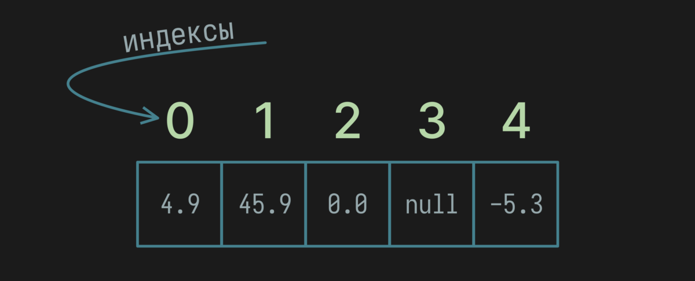

Почему массивы так важны? Ответ очень прост - это базовая и единственная
структура для хранения набора значений не являющейся классом.

Если мы посмотрим на классы в Collection Framework, то увидим -
часть классов используют массив внутри себя для хранения перечисления объектов,
к примеру, можно назвать ArrayList, HashSet, HashMap, ArrayDeque,
PriorityQueue, CopyOnWriteArrayList.

> Для Map обязательно стоит сделать примечание, ведь Map стоит отдельно
> в иерархии классов и не является прямым наследником Collection. При
> этом по смыслу это тоже набор значений.

## Что такое массив?

Массив является ссылочным типом данных, но назвать это объектом у меня не получается.
С одной стороны он похож на объект, так как может быть null.
С другой стороны не имеет никаких своих методов, а только одно свойство - длина массива.

Пройдемся кратко по всем особенностям и свойствам, а после
разберем как работать с массивами и на практике познакомимся с особенностями:

1. Это базовая структура данных, которая может <mark>хранить фиксированное
    количество значений</mark>. Это значит, что если создан массив содержащий
    5 элементов, мы не можем удалить элемент или добавить элемент. Массив будет
    всегда на 5 элементов. При этом, мы всегда можем поменять значение любого элемента
    в массиве.

    Для хранения массивов <mark>используется область памяти Heap</mark>, что является областью
    памяти, предназначенной для динамического распределения памяти во время
    выполнения программы. Массив является ссылочным типом переменных.

    ```java
    // cоздание массива на 5 элементов типа char
    var charArray = new char[5];
    ```

    

1. Имеется <mark>прямой доступ к каждому элементу</mark>. Каждый элемент имеет свой индекс,
   можно считать порядковым номером. По индексу мы можем получить значение любого элемента массива.
   <mark>Индекс начинается с нуля.</mark>  Первый элемент массива находится по индексу 0, второй по
   индексу 1 и так далее.  Это значит, если в массиве 5 элементов, первый имеет индекс 0, а последний -
   индекс 4.

   В коде, для обращения к элементу в [] указывается индекс нужной ячейки.

   ```java
   var doubles = new Double[]{4.9, 45.9, 0, null, -5.3}

   // получаем значение последнего элемента по индексу и записываем
   // в переменную lastElement, тип переменной будет Double
   var lastElement = doubles[4]; // -5.3

   ```

   

1. Знает свою длину. Свойство `length` содержит значение количества элементов в массиве.
   Других свойств у него нет. Из методов можно найти наследованные от Object, но эти методы
   обычно не используются напрямую, так как мы не можем повлиять на их поведение или продолжить
   иерархию и переопределить поведение методов.

   ```java
   var array = new int[15];
   var arrayLength = array.length; //15
   ```

1. Массивы <mark>эффективны с точки зрения памяти и времени доступа к элементам</mark>. Так как
   под них выделяется непрерывный блок памяти, это и позволяет быстро обращаться
   к каждому элементу или обходить все элементы подряд.

1. <mark>Каждый массив типизирован.</mark> При создании массива обязательно указывается тип
   данных, которые может содержать массив, другой тип в него не записать. Также
   одной из особенностью является возможность хранить примитивные типы данных: int,
   short, byte, long, float, double, boolean.

   ```java
   int[] arrayOfInt = {1,2}; //массив int значений
   var arrayOfBoolean = new boolean[2]; // массив boolean значений
   var arrayOfLong = new long[]{45L, 4L}; // массив long значений
   var orders = new Order[2]; // массив из объектов Order
    ```

1. Массив можно положить в другой массив и <mark>получить многомерный массив</mark>.
   Двумерный массив можно представить как матрицу, также это называют массивом массивов

   ```java
    var matrix2x2 = new long[][]{
        new long[]{6L, 4L},
        new long[]{1L, 3L}
    };
   ```

## Как создать массив?

Во первых, мы можем просто объявить переменную, которой позже присвоим массив.
При этом мы не можем использовать `var`, это логично, ведь нам надо заранее знать тип
переменной:

```java
String[] strings;
int[][] matrix2D;
BigDecimal[][][] matrix3D;
Point[] points;
```

> В последнем примере, каждый элемент массива это список из объектов `Point`.

Создание и присвоение массива переменной, от простого к более сложному:

1. Объявляем массив состоящий из 10 строк, в классической записи

    ```java
    String[] strings = new String[10]
    ```

    Или используя `var`, так как у нас уже в правой части указан тип,
    так мы упрощаем запись, а также проще сменить тип - надо только
    поменять правую часть:

    ```java
    var strings = new String[10];
    ```

    Такой способ подходит, когда мы заранее не знаем какие значение в массиве
    будут при его создании, значения будут заполнены позже.

    Содержимое массива будет состоять из `null`, так как для всех ссылочных
    переменных по умолчанию массив заполняется `null`.

    ```text
    [null, null, null, null, null, null, null, null, null, null]
    ```

    💡 А если вам надо создать пустой массив, то напишите просто 0 в качестве
    количества элементов или оставьте `{}` пустым.

    ```java
    var emptyStrings = new String[0];
    var anotherEmptyStrings = new String[]{};
    ```

    Первый вариант более наглядный.

    Это бывает полезным, когда надо вернуть в результате работы
    метода массив, но возвращать нечего, а `null` возвращать -
    дурная привычка.

1. Объявляем массив состоящий из трех целочисленных значений и
  сразу заполняем все ячейки, удобно когда мы знаем все элементы заранее:

    ```java
    var arrayOfInt = new int[]{1, 2, 3};
    ```

    Содержимое массива будет идентично перечислению при создании:

    ```text
    [1, 2, 3]
    ```

1. Создание двумерных массивов это комбинация из предыдущих вариантов:

    - для двумерной матрицы 3x3 состоящей из символов читаемый вид будет

        ```java
         var xo = char[][]{ // 👍
            {'x', 'x', 'o'},
            {'o', 'x', 'x'},
            {'x', 'x', 'o'}
        };
        ```

    - можно выполнить запись и в полном виде, но так точно читаемость ухудшается.
  
        ```java
        char[][] xo = new char[][]{ // 👎
                new char[]{'x', 'x', 'o'},
                new char[]{'o', 'x', 'x'},
                new char[]{'x', 'x', 'o'}
        };
        ```

        Нет никакой причины использовать столь громоздкую запись.

    - Если надо создать трехмерный массив, что нужно достаточно редко, то
  в предыдущей записи каждый элемент заменяется на массив:

        ```java
        var xo3d = new char[][][]{
                {{'x', 'o'}, {'o', 'o'}, {'x', 'o'}},
                {{'o', 'o'}, {'o', 'o'}, {'x', 'o'}},
                {{'x', 'x'}, {'o', 'x'}, {'x', 'o'}}
        };
        ```

        Таким образом получает массив из вложенных массивов, в каждом из
        вложенных массивов еще один массив из двух элементов.

## Значения по умолчанию при создании пустого массива

Правило простое, если объявляется пустой массив с примитивными типами
данных, то все элементы массива будут имеет значение в виде значению по умолчанию
для примитива. Примеры для всех видов примитивов:

```java
var booleans = new boolean[3]; // [false, false, false]
var bytes = new byte[3]; // [0, 0, 0]
var shorts = new short[3]; // [0, 0, 0]
var ints = new int[3]; // [0, 0, 0]
var longs = new long[3]; // [0, 0, 0]
var floats = new float[3]; // [0.0, 0.0, 0.0]
var doubles = new double[3]; // [0.0, 0.0, 0.0]
var chars = new char[3]; // ['\u0000', '\u0000', '\u0000'] 
```

Для всех ссылочных типов массив будет содержать `null`, будь-то строка,
объект или другой массив. Это касается и объектов-упаковок для примитивных типов,
таких как Byte, Short, Integer, Long, Float, Double, Boolean, Character.

```java
var strings = new String[3]; // [null, null, null]
var points = new Point[3]; // [null, null, null]
var innerArrays = new Integer[2][3]; // [[null, null, null], [null, null, null]]
var booleans = new Boolean[3] // [null, null, null]
```

## Работа с массивами

Основные действия при работе с массивами:

- получение количества элементов массива
- чтение значения элемента по индексу
- изменение значения элемента по индексу
- обход всего массива для поиска элемента, работы с каждым или избранным элементом
- копирование массива
- расширение массива на основе существующего

Для изучения всех действий создадим массив и заполним его данными сразу при создании.
Представим, что в массиве хранятся значение температуры с разных датчиков, если датчик не
работает, то значение будет `null`. Для избежания проблем с точностью вычислений будем
использовать `java.math.BigDecimal`:

```java
var temps = new BigDecimal[]{
        BigDecimal.valueOf(28.35),
        null,
        BigDecimal.valueOf(23.6),
        BigDecimal.valueOf(20),
        null
};
```

### Размер массива

У массива только одно свойство - длина. Длина массива
имеет тип `int` - а это явно намекает на максимальное
количество элементов в массиве, элементов в массиве может быть
не более `Integer.MAX_VALUE` = 2147483647. Попробуйте создать
массив на большее количество элементов и убедитесь в этом :)

```java
var sensorsCount = temps.length; // 5
```

> `length` не метод, писать () в конце не надо

### Чтение значения элемента по индексу

Для обращения к любому элементу массива используется индекс
элемента. Например, чтобы получить значение первого элемента
используем индекс 0, для второго 1 и так далее.

Получим значение третьего элемента массива температур и распечатаем
значение:

```java
var thirdElement = temps[2];
System.out.println(thirdElement); // 23.6
```

Индекс указывается в квадратных скобках после имени массива.

Таким образом можно быстро обращаться к любому элементу массива.
Важное преимущество массива - это обращение к любому элементу за
фиксированное время и это не зависит от положения элемента в
структуре, не важно элемент первый, последний или
в середине, время доступа к каждому элементу будет практически одинаково.

Один из примеров использования обращения по индексу это получение
случайного элемента из массива:

```java
var temps = new BigDecimal[]{ // создаем массив
        BigDecimal.valueOf(28.35),
        null,
        BigDecimal.valueOf(23.6),
        BigDecimal.valueOf(20),
        null
};

// записываем в randomTemperature одно значение случайно выбранного элемента
var randomTemperature = temps[new Random().nextInt(temps.length)];
```

- `new Random()` - создаем класс генерирующий случайные числа
- `nextInt(int bound)` - метод генерирующий `int` значения, в
  диапазоне от 0 до `bound`, не включая `bound`

Получается генерация целого числа от 0 до размера массива.
Включая 0, но исключая само значение длины массива.

### Изменение значения элемента по индексу

Изменить значение также просто как и обратится к нему:

```java
temps[1] = new BigDecimal(19);
```

В [] скобках указывается индекс ячейки в которую мы хотим
положить новое значение. Для элементов ссылочного
типа возможно установить значение `null`;

```java
temps[3] = null;
```

### Обход массива

Обход массива - перебор всех элементов массива по очереди в прямом
или обратном порядке.

#### Прямой порядок

Самый просто вариант обхода массива - использование `for` с индексом.

Для начала, давайте просто распечатаем все значения нашего массива в
прямом порядке, от первого до последнего элемента:

```java
for (int i = 0; i < temps.length; i++) {
    System.out.println(temps[i]);
}
```

Цикл начинает работу со значения 0 (`int i = 0`), после каждого цикла
увеличивает значение i на 1 (`i++`) и циклы повторяются до тех пор пока
i будет меньше чем длина массива (`i < temps.length`). Последний цикл
будет использовать i = temps.length - 1, то есть индекс последнего элемента.

В итоге получим на каждой строке значение:

```text
23.6
28.35
null
23.6
20
null
```

Другой вариант прямого прохода - использование Enhanced For. Перебор
элементов по очереди без индекса.
Подходит когда не требуется работа с индексами и только для прямого прохода:

```java
for (var temp : temps) {
    System.out.println(temp);
}
```

#### Обратный порядок

В этом случае нам подходит только вариант обычного for:

```java
for (int i = temps.length - 1; i >= 0; i--) {
    System.out.println(temps[i]);
}
```

Цикл начинает работу c индекса последнего элемента, в нашем случае это
значение 4 (`int i = temps.length - 1`), после каждого цикла
уменьшаем i на 1 (`i--`) и циклы повторяются до тех пор пока
i больше или равно 0 (`i >= 0`).

Результат:

```text
null
20
23.6
null
28.35
```

## Практическая работа

### Поиск максимального и минимального элемента в массиве

Необходимо написать метод, который принимает массив `int` и
находит максимальное значение среди всех элементов.

Пример, массива:

```java
var ints = new int[]{10, 50, 45, 99, -3, 0};
```

Для поиска максимального значения:

- создаем переменную `max` которая будет хранить максимальное значение. Ее
  первоначальное значение `Integer.MIN_VALUE`, так как любой элемент массива
  будет больше или равен этому значению и при сравнении `max` может только
  увеличиваться.
- обходим массив в прямом порядке и каждый раз сравниваем значение `max`
  с текущим элементов. Если элемент больше `max` - записываем в `max` значение
  текущего элемента. Если меньше или равно - ничего не делаем в цикле.
- возвращаем в результате работы метода `max`

Давайте будем считать, что массив всегда имеет один и более элементов, тогда
полный код будет:

```java
public class Main {

    public static void main(String[] args) {
        var ints = new int[]{10, 50, 45, 99, -3, 0};
        var max = findMax(ints);
        System.out.println(max);
    }

    private static int findMax(int[] ints) {
        int max = Integer.MIN_VALUE;

        for (var current : ints) {
            if (current > max) {
                max = current;
            }
        }

        return max;
    }
}
```

Это отлично работает! Но что, если у нас массив будет пустой?

```java
public static void main(String[] args) {
    var ints = new int[0];
    var max = findMax(ints);
    System.out.println(max);
}
```

В консоли увидим строку `-2147483648`. Это произошло, так как
`max` мы назначили, но цикл не запускался, так и вернулось значение
`Integer.MIN_VALUE`.

Нам надо как-то оповестить пользователя нашего метода, о том - что мы не нашли
максимальное значение. Самый простой вариант это проверить, пустой ли массив и если
пустой - как-то передать эту информацию вне метода.

 Вижу тут три варианта:

- Выбросить исключение и тогда программа не сможет вычислить и упадет с ошибкой.
  В дальнейшем придётся обрабатывать ошибку - не очень удобный вариант.
- Поменять тип возвращаемого значения на обертку `Integer` и тогда мы сможем вернуть
  `null`. Вариант получше, так как достаточно результат метода проверить на `null` и
  решить что делать дальше. Из минусов - мы не всегда может точно сказать, почему появился
  `null` - это нормальное поведение или произошла ошибка в работе метода.
- Использовать `Optional<Integer>`, специальный класс обертка, который может содержать значение
  или быть "пустым". Оптимальный вариант, используйте его если вам известен этот класс.

Давайте покажу оба последних варианта, а вы можете выбрать подходящий и более понятный для вас:

- Используем `null`:

```java
private static Integer findMax(int[] ints) {
    // если пустой массив -> сразу возвращает null
    if (ints.length == 0) {
        return null;
    }

    // мы точно знаем, что у нас есть хотя бы один элемент, можно 
    // его и использовать как начальный для max
    var max = ints[0];

    // а обходить можно уже со второго элемента, индекс 1
    for (int i = 1; i < ints.length; i++) {
        var current = ints[i];
        if (current > max) {
            max = current;
        }
    }

    return max;
}
```

Вариант с `Optional` будет очень похожим, только вместо `null` возвращаем
`Optional.empty()`:

```java
private static Optional<Integer> findMax(int[] ints) {
    if (ints.length == 0) {
        return Optional.empty();
    }

    var max = ints[0];
    for (int i = 1; i < ints.length; i++) {
        var current = ints[i];
        if (current > max) {
            max = current;
        }
    }

    return Optional.of(max);
}
```

✏️ Попробуйте для закрепления материала написать метод `findMin(int[] ints)`.
Метод должен вернуть минимальное значение среди значений массива или вернуть
`null` если массив пустой и определить минимальное значение невозможно.

Проверьте свой код на массивах:

```java
System.out.println(min(new int[]{1, 2, 3}) // ожидается 1
System.out.println(min(new int[]{-1, -2, -3}) // ожидается -3
System.out.println(min(new int[0]) // ожидается null
System.out.println(min(new int[]{}) // ожидается null
```

🧐 Если не удалось выполнить - 

### Массив температур BigDecimal

Давайте посчитаем среднее значение температур из доступных датчиков.
Для удобства и разделения логики выделим подсчет в отдельный метод, который
будет возвращать `BigDecimal`, а если все датчики не выдали значения или массив пуст,
то возвращать `null`. Считаем что null аргумент нам не передадут:

```java
public BigDecimal average(BigDecimal[] temperatures) {
    if (temperatures.length == 0) {
        return null;
    }

    var sum = BigDecimal.ZERO;
    var nonNullTemps = 0;

    for (int i = 0; i < temperatures.length; i++) {
        var currentTemp = temperatures[i];
        if (currentTemp != null) {
            sum = sum.add(currentTemp);
            nonNullTemps++;
        }
    }

    return nonNullTemps == 0 ? null :
            sum.divide(BigDecimal.valueOf(nonNullTemps),
                    RoundingMode.HALF_UP);
}
```

Что тут происходит:

- проверяем, если массив передали пустой → сразу возвращаем null, считать нечего
- для подсчета среднего нам надо знать сумму всех не-null
  элементов (sum) и их количество (nonNullTemps)
- проходим по всем элементам массива и для не-null значений добавляем
  их в сумму и увеличиваем счетчик не-null значений
- перед возвратом значения, проверяем если все значения null,
  то сразу возвращаем null. В другом случае делим
  сумму на количество элементов и получаем среднее значение температур.

💡 Давайте улучшим код:

- используем Enhanced For, ведь нам не надо использовать индекс при переборе
- нежелательно возвращать null, так как происхождение null может иметь разные
  причины, есть специальный класс обертка Optional.
  
Если вы еще не знакомы с Optional - это нормально,
можете попробовать понять как это работает по коду и после изучить отдельно.

```java
    public Optional<BigDecimal> average(BigDecimal[] temperatures) {
        if (temperatures.length == 0) {
            return Optional.empty();
        }

        var sum = BigDecimal.ZERO;
        var nonNullTemps = 0;

        for (var currentTemp : temperatures) {
            if (currentTemp != null) {
                sum = sum.add(currentTemp);
                nonNullTemps++;
            }
        }

        return nonNullTemps == 0 ? Optional.empty() :
                Optional.of(sum.divide(BigDecimal.valueOf(nonNullTemps),
                        RoundingMode.HALF_UP));
    }
```

Может показаться, что кода много для простого расчета среднего значения.
Но тут стоит учесть - наш код надежен, проверены все возможные случаи, чтобы
избежать ошибок при различном наборе значений в массиве.

Код сделать можно еще проще, если использовать Stream API. Если это для
вас в новинку, просто оцените и вам захочется быстрее приступить к изучению
Stream API:

```java
    public Optional<BigDecimal> average(BigDecimal[] temperatures) {
        Optional<BigDecimal> sum = Arrays.stream(temperatures)
                .filter(Objects::nonNull) // Игнорируем null значения
                .reduce(BigDecimal::add); 

        long nonNullTemps = Arrays.stream(temperatures)
                .filter(Objects::nonNull) // Игнорируем null значения
                .count();

        return sum.map(s -> s.divide(new BigDecimal(nonNullTemps),
                        RoundingMode.HALF_UP));
    }
```

## Итого

Вам важно для работы с массива знать:

- массивы - это наборы данных без возможности изменить количество элементов
- массивы имеют одной свойство - длина массива
- квадратные скобки [] используются для создания массива, обращения по к элементу по индексу
- индексы массива указывает на расположение элемента. Индекс начинается с 0.
- массивы можно обходить в прямом и обратном направлении

Спасибо за чтение статьи, добавляйте в закладки
и делитесь с теми - кому это может быть полезно.
