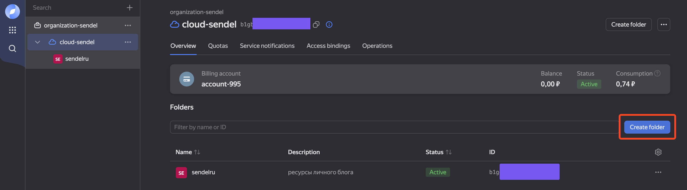
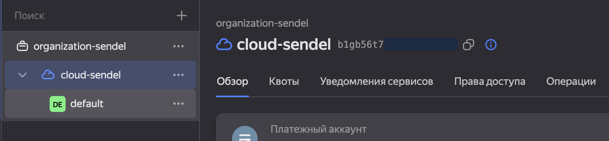
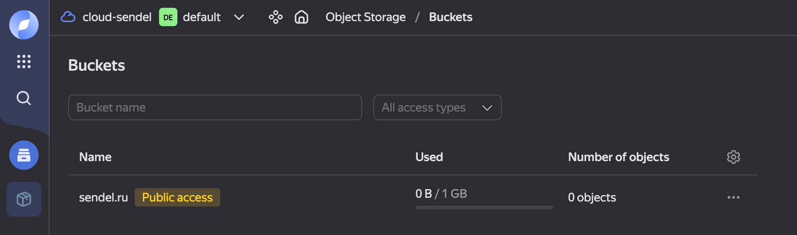
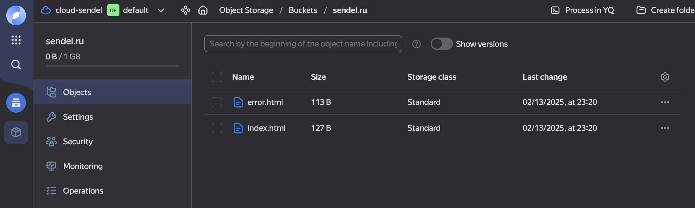
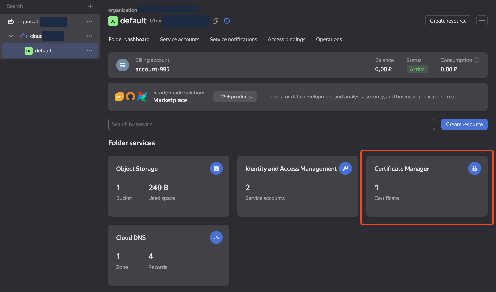
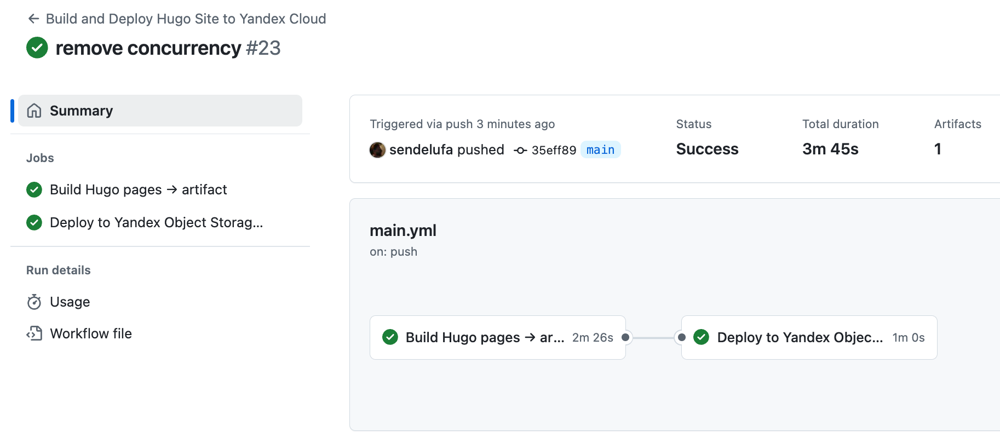
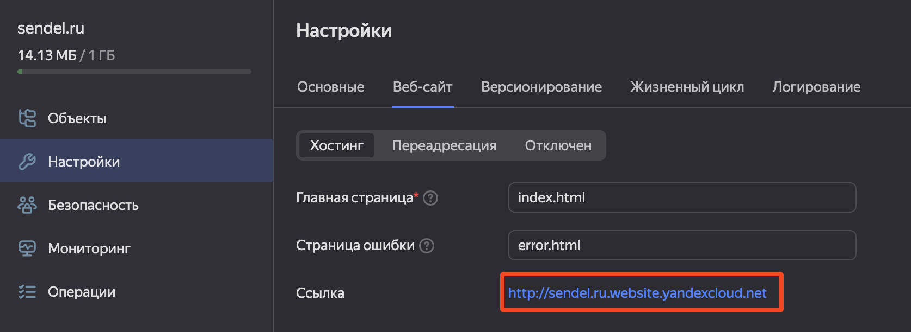
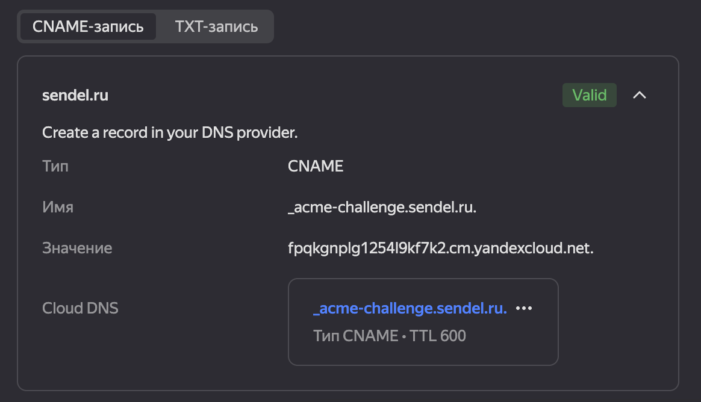
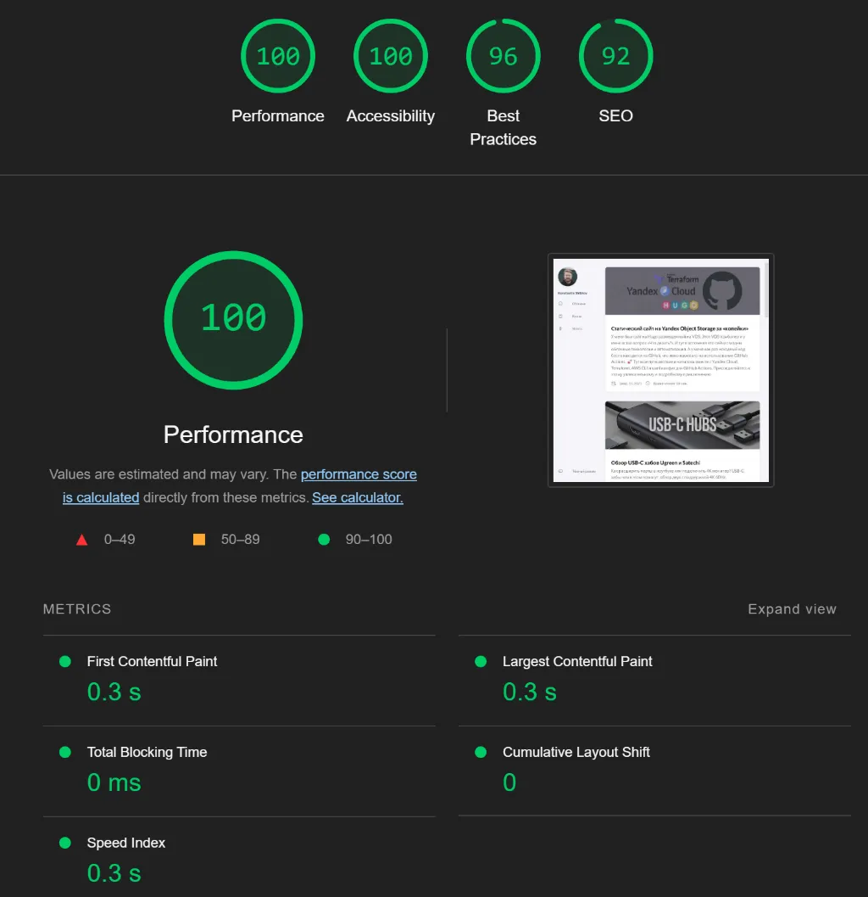

> ❇️ Когда пишу эти строки мне еще неизвестно какой путь стоит пройти
> и что необходимо выполнить. Методика написания этой статьи – логирование
> действий от начала до получения результата. В итоге получилось
> местами просто копирование инструкции из документации, только
> со своими пометками в местах где не совсем для меня понятно.

## Зачем я это делаю

Мой личный блог последние несколько лет с 2020 по 2025 хостился на
супер дешевой VPS за 79₽/мес. Для блога использовалась связка из генератора
статических сайтов Hugo + веб сервер caddy + GitHub Actions. Это все замечательно
и быстро работает. Но в один прекрасный момент закончилось место на VPS, за 79₽
даже на блог перестало хватать. А новые тарифы VPS для небольшого личного
блога не имеют смысла.

Поэтому и появилась идея перенести в облако статический сайт используя технологию
хранения статических файлов Object Storage.

> Object Storage, или объектное хранилище, является одним из ключевых
> типов хранения данных в облачных технологиях. Оно предназначено для
> хранения больших объемов неструктурированных данных и широко
> используется благодаря своей гибкости и масштабируемости.
>
> Object Storage хранит данные в виде объектов. Каждый объект содержит
> сами данные, метаданные и уникальный идентификатор. Эта структура
> позволяет легко управлять данными без жесткой иерархии, как это
> происходит в традиционных файловых системах.
>
> Позволяет привязывать домены для прямого доступа к объектам хранилища.

Решил обратить внимание на Yandex Cloud, так как не было опыта работы с ним.
Предложение от Yandex Cloud включает Object Storage, подключение домена к бакету
(это как папка в обычной файловой системе), доступ по API и через CLI.

## Начало и требования

Конечно, надо выполнить все формальности и зарегистрироваться в 
.
Благо не надо объяснять как это сделать.

У Яндекса есть

по использованию Object Storage для статических сайтов. И она отлично
подходит, если вам надо загрузить несколько файлов и сделать что-то типа
лендинга или сайта-визитки/портфолио/обо-мне. Так как загрузить
небольшое количество файлов без частого обновления не составит труда через
веб интерфейс. 

Но если сложная структура сайта, с множеством файлов и деревом папок.
Загрузить даже вручную будет сложно, а обновлять точечно тем более.

Моя задача:

- использовать Terraform для управления инфраструктурой и легко повторять
действия по поднятию инфры при необходимости
- исходный код сайта на GitHub
- использовать автоматическое обновление файлов в бакете при появлении новых
коммитов в мастер используя GitHub Actions

## Подготовка

> Данный блок практически копия официальной инструкции,
> только я убрал все лишнее и сделал прямой путь до цели

Первое, что я сделал создал Folder (Каталог) в облаке, в нем будут
все ресурсы для работы с сайтом. Назвал `sendelru`. Это
сделал через Веб Консоль



Чтобы работать с облаком надо поставить Yandex Cloud CLI,
мне точно это надо, ведь я хочу всё автоматизировать.

Установил  и создал профиль для подключения к своему облаку используя инструкцию из раздела Создание профиля >
Аккаунт на Яндексе.

Тут проблем нет и все понятно. Из рекомендаций выбирать зону последнюю из списка,
в моем случае это была `ru-central1-d`, как сказано в описании зон – менее
нагруженная.

Ожидаемый результат на этом этапе при выполнении команды `yc config list`
должен быть результат похожий на:

```bash
token: y0__xDs***
cloud-id: b1gb***
folder-id: b1ge***
compute-default-zone: ru-central1-d
```

Создание инфраструктуры будет выполнено через Terraform,
его необходимо .

После установки Terraform я сразу поплыл. Никакого опыта
у меня с ним нет. У Яндекса множество разных инструкций и
изначально я пошел по пути ручного создания сервисного
аккаунта (через него будет производится действия с инфраструктурой),
настройки отдельно каждый ресурс. А их немало, кроме
Object Storage надо настроить DNS, настроить сертификат TSL для
сайта. А это приходится разбираться с особенностями конфигурации
каждого ресурса. А это статья не про изучение терраформа, поэтому
иду по короткому маршруту.

После установки добавляю в конфиг `~/.terraformrc` настройку
провайдера Yandex Cloud:

```tf
provider_installation {
  network_mirror {
    url = "https://terraform-mirror.yandexcloud.net/"
    include = ["registry.terraform.io/*/*"]
  }
  direct {
    exclude = ["registry.terraform.io/*/*"]
  }
}
```

Возвращаемся к .

Мне говорят надо создать сервисный аккаунт для управления ресурсами.
С помощью него и будем выполнять действия по
управлению облаком, есть вариант использовать доступ
через токен пользователя. Только это не рекомендуется, небезопасно.

Вам потребуется ID облака. Его можно найти в Веб Консоли.



### Создание сервисного аккаунта

Создать сервисный аккаунт просто.

```bash
yc iam service-account create --name <имя_сервисного_аккаунта>
```

я использую `sa-terraform`

```bash
yc iam service-account create --name sa-terraform
```

В итоге получаю

```bash
id: aje64***
folder_id: b1ge***
created_at: "2025-02-14T10:22:17.789558344Z"
name: sa-terraform
```

`folder_id` по умолчанию должно соответствовать вашему
каталогу в котором и будете создавать Object Storage

> Если вам надо пересоздать аккаунт.
> Для удаления сервисного аккаунта используйте команду
> `yc iam service-account delete --name sa-terraform`
> 
Идем дальше по инструкции и назначаем роли, для этого
получаем список сервисных аккаунтов и узнаем ID:

```bash
yc iam service-account list
```

```bash
+----------------------+--------------+--------+---------------------+-----------------------+
|          ID          |     NAME     | LABELS |     CREATED AT      | LAST AUTHENTICATED AT |
+----------------------+--------------+--------+---------------------+-----------------------+
| aje64***             | sa-terraform |        | 2025-02-14 10:22:17 |                       |
+----------------------+--------------+--------+---------------------+-----------------------+
```

Назначаем права доступа для сервисного аккаунта:

```bash
yc <service-name> <resource> \
  add-access-binding <resource-name>|<resource-id> \
  --role <role-id> \
  --subject serviceAccount:<service-account-id>
```

Так как я не знаю тонкостей, я хочу, чтобы сервисный
аккаунт управлял всеми ресурсами облака и использую:

- **service-name** = `resource-manager`
- **resource** = `cloud`
- **resource-id** = ID моего облако, найти через `yc config list`
- **role-id** = `resource-manager.clouds.owner`
- **service-account-id** = ID из таблички списка сервисных
аккаунтов

В итоге получилась такая команда:

```bash
yc resource-manager cloud \
add-access-binding b1gb*** \
--role resource-manager.clouds.owner \
--subject serviceAccount:ajea***
```

Получил `done (3s)` и никаких ошибок.

### Настроить CLI для выполнений операций

Теперь надо получить ключи доступа для работы с облаком.
Для этого есть команда `key create`

```bash
yc iam key create \
  --service-account-id <ID сервисного аккаунта из таблицы> \
  --folder-id <ID Каталога> \
  --output key.json
```

В инструкции указана команда с `--folder-name`, я по
невнимательности вставлял туда ID Каталога. Поэтому, тоже
обратите внимание и значение вставляйте правильное. Мне
было удобнее работать с ID, так как он был под рукой.

> Желательно выполнять команду в отдельной директории,
> чтобы не потерять key.json файл
ID или имя каталога вы можете получить командой:

```bash
yc resource-manager folder list --cloud-id <ваш_ид_облака>
+----------------------+---------+--------+--------+
|          ID          |  NAME   | LABELS | STATUS |
+----------------------+---------+--------+--------+
| b1ge***              | default |        | ACTIVE |
+----------------------+---------+--------+--------+
```

Этот ID и используйте, все ок:

```
yc iam key create \
  --service-account-id aje64*** \
  --folder-id b1ge*** \
  --output key.json
id: ajel***
service_account_id: aje64***
created_at: "2025-02-13T17:31:19.434313786Z"
key_algorithm: RSA_2048
```

В той папке, где выполняли команду у вас появится
файл `key.json`. 

Далее создавайте профиль, тут просто

```bash
yc config profile create <имя_профиля>
```

Я указал `sa-terraform`

```bash
yc config profile create sa-terraform
Profile 'sa-terraform' created and activated
```

Теперь дальше все по инструкции задавайте конфигурацию профиля:

```bash
yc config set service-account-key key.json
yc config set cloud-id <идентификатор_облака>
yc config set folder-id <идентификатор_каталога>
```

Для работы с облаком необходимо актуальный токен и желательно
его хранить в переменных окружения, дока говорит, что он живет
12 часов, но желательно обновлять чаще. Для использования
в текущей сессии токены и IDs:

```bash
export YC_TOKEN=$(yc iam create-token)
export YC_CLOUD_ID=$(yc config get cloud-id)
export YC_FOLDER_ID=$(yc config get folder-id)
```

🚀 На этом создание сервисного профиля завершено.

Зачем я все это сделал? Сервисный аккаунт управляет всеми
ресурсами, с помощью него можно управлять ресурсами: создавать,
удалять или наполнять файлами Object Storage. У этого аккаунта
сейчас широкие права, поэтому его необходимо использовать

## Конфигурация Terraform

После изучения доки нашел .

Клонируйте репозиторий

```bash
git clone https://github.com/yandex-cloud-examples/yc-s3-static-website.git
```

Перейдя в папку репозитория, выполните `terraform init`. Будут созданы:

- Каталог `.terraform`. В этом каталоге Terraform сохраняет загруженные модули.
Когда вы используете внешние модули, указанные в конфигурации через источники
(например, из реестра Terraform, репозиториев Git или других мест),
Terraform загружает их в подкаталог внутри .terraform/modules/.
- Файл `.terraform.lock.hcl`. Этот файл предназначен для блокировки
версий провайдеров и модулей.

В итоге успешное выполнение `terraform init`:

```bash
Initializing the backend...
Initializing provider plugins...
- Finding latest version of yandex-cloud/yandex...
- Installing yandex-cloud/yandex v0.137.0...
- Installed yandex-cloud/yandex v0.137.0 (unauthenticated)
Terraform has created a lock file .terraform.lock.hcl to record the provider
selections it made above. Include this file in your version control repository
so that Terraform can guarantee to make the same selections by default when
you run "terraform init" in the future.

Terraform has been successfully initialized!
```

🚀 Теперь можно через конфигурацию создавать
и настраивать ресурсы в облаке.

## Создание ресурсов через Terraform

Вы можете скопировать файлы из клонированного репозитория yc-s3-static-website
в отдельную рабочую папку или выполнять редактирование прямо скаченного файла
`static.tf`. Я открыл для редактирования файл и поменял два параметра:

```tf
locals {
  folder_id = "<идентификатор_каталога>"
  domain    = "<домен>"
}
```

- `folder_id` это каталог облака, вспомнить его командой
`yc resource-manager folder list --cloud-id <ваш_ид_облака>`
- `domain` вашего сайта, без http/https и слэша в конце.
У меня это `sendel.ru`

```tf
locals {
  folder_id = "b1ge***"
  domain    = "sendel.ru"
}
```

Сохранил файл и провалидировал конфигурацию:

```bash
terraform validate
```

Все прошло без проблем
```
terraform validate
Success! The configuration is valid.
```

> В одном эксперименте получил ошибку дубликата настроек провайдера.
> Причина – у меня было два .tf файла в одной папке где я инициировал
> Terraform. У вас должен быть только static.tf в рабочей папке.

Далее можно посмотреть план вносимых изменений. Там очень много текста, большинство
параметров помечены как «будет известно после применения». 

```
terraform plan
```

Ок, тогда применяю все это:

```bash
terraform apply
```

Необходимо перед выполнение ввести `yes` для подтверждения выполнения изменений.

Тут снова меня встретила ошибка, я думал что данные о файлах `index.html` и `error.html` это просто конфигурация. 

```
Error: error creating storage object: error parsing source: error opening storage bucket object source (index.html): open index.html: no such file or directory
│ 
│   with yandex_storage_object.index-html,
│   on static.tf line 75, in resource "yandex_storage_object" "index-html":
│   75: resource "yandex_storage_object" "index-html" {
```

Но оказалось, эти файлы копируются сразу в бакет. Значит рядом с файлом `static.tf` надо положить `index.html` и `error.html` из репозитория с примером конфигурации. Скопировал файлы и снова запустил `terraform apply`.

Теперь прошло все без ошибок, результат:

```
yandex_storage_object.index-html: Creating...
yandex_storage_object.error-html: Creating...
yandex_storage_object.index-html: Creation complete after 0s [id=index.html]
yandex_storage_object.error-html: Creation complete after 0s [id=error.html]

Apply complete! Resources: 2 added, 0 changed, 0 destroyed.
```

Если зайти в веб интерфейс консоли управления облаком то в каталоге
найдете созданный бакет и файлы в нем, а значит бакет был успешно
создан и файлы загружены.





И файлы доступны по ссылке http://sendel.ru.website.yandexcloud.net

## Сертификат TLS

За счет конфигурации ресурсов через terraform сертификат уже будет создан,
описание выпуска Let's Encrypt сертификата описано в блоках:

```terraform
data "yandex_cm_certificate" "example" {
  depends_on      = [yandex_dns_recordset.validation-record]
  certificate_id  = yandex_cm_certificate.le-certificate.id
  #wait_validation = true
}

resource "yandex_cm_certificate" "le-certificate" {
  name    = "my-le-cert"
  domains = ["${local.domain}"]

  managed {
  challenge_type = "DNS_CNAME"
  }
}
```

Проверить созданный сертификат можете в веб интерфейсе консоли облака



А значит никаких действий больше не потребуется по настройке
ресурсов облака. Удобненько!

🚀 В итоге созданы все ресурсы для статического сайта и дополнительно
создан еще одни сервисный аккаунт `my-sa` с правами `storage.editor`.
Аккаунт `my-sa` может только изменять файлы в хранилище, изменять
ресурсы и управлять облаков у него нет возможностей.

## Загрузка файлов сайта через AWS CLI

Вот и подошли к самому интересному, как обновлять файлы в бакете.

Предлагаю разделить это на две части. Первое это провернуть обновление
локально, то есть когда файлы есть у нас на локальном 
компьютере и как то их забрасывать в бакет. 
Вторым этапом повторить это в GitHub Actions.

Так как Yandex Object Storage совместим с S3 протоколом, то потребуется использовать AWS CLI.

В этом случае меня немного инструкция подвела, так как у меня по
инструкции скачалась последняя версия WS CLI, а необходимо версию
не выше 2.22.35. Если версия будет выше, файлы не получиться
загрузить, так как будет ошибка контролных сумм (я проверял).

Как установить нужную версию:

- MacOs

```bash
curl "https://awscli.amazonaws.com/AWSCLIV2-2.22.35.pkg" -o "AWSCLIV2.pkg"
sudo installer -pkg AWSCLIV2.pkg -target /
```

- Linux

```bash
curl "https://awscli.amazonaws.com/awscli-exe-linux-x86_64-2.22.35.zip" --output "awscliv2.zip"
unzip awscliv2.zip
sudo ./aws/install
```

Проверьте версию:

```bash
aws --version

aws-cli/2.22.35 Python/3.12.6 Darwin/24.1.0 exe/x86_64
```

Теперь можно работать 🙂

Перед началом настройки подключения необходимо получить два ключа:

- **AWS Access Key ID** - идентификатор статического ключа,
при использовании static.tf он уже создан и описан ресурсом

```terraform
resource "yandex_iam_service_account_static_access_key" "sa-static-key" {
  service_account_id = yandex_iam_service_account.sa.id
  description        = "static access key for object storage"
}
``` 

- **AWS Secret Access Key** - можно получить через консоль для 
сервисный аккаунт `my-sa`. 

```bash
yc iam access-key create \
--service-account-name my-sa
```

Ключ в поле `secret`, а в поле `key_id` вы найдете
идентификатор AWS Access Key ID.  

Самое время запустить конфигурацию AWS CLI.

```bash
aws configure
```

Введите ключи и регион `ru-central1`, остальные параметры не вводите, просто прожимайте Enter.

При валидном вводе всех параметров не будет ошибок.

Указывайте эндпоинт для Object Storage

```bash
aws configure set endpoint_url https://storage.yandexcloud.net/
```

А теперь можно синхронизовать файлы командой

```bash
aws s3 sync <локальный-путь-до-сайта>/ s3://<название бакета>
```

В свою очередь, дополнительно сгенерил сайт с помощью Hugo, команда
`hugo` и указал папку `public`. У меня получилось так:

```bash
aws s3 sync ~/sendel_ru_blog/public/ s3://sendel.ru
```

> Если у вас ошибка `SignatureDoesNotMatch` это признак
> не верных AWS Secret Access Key и/или AWS Access Key ID.

После загрузки всех файлов, проверяю работает ли сайт по
внутреннему адресу облака http://sendel.ru.website.yandexcloud.net

✅ Это уже успех!

🚀 Подведем итог.

Такой ручной подход нам помог понять требования для настройки
автоматической синхронизации файлов, необходимо:

- AWS CLI версии 2.22.35
- KEY ID и SECRET_KEY для доступа к Object Storage через
AWS CLI
- указывать адрес Object Storage для AWS CLI
- файлы для загрузки в Object Storage

И это все потребуется для построения GitHub Actions.

## Собираем и загружаем сайт через GitHub Actions

Файл конфигурации GitHub Actions располагается в репозитории по пути
`.github/workflows/main.yml`. Вы можете создать новый Action через веб интерфейс
и тогда файл появится или просто создать этот файл.

Action будет запускаться при пуше в ветку main.

Предлагаю сделать всю работу в два этапа:

1. Сборка сайта и получение артефакта в виде папки `public`, в который
   Hugo собирается сайт
2. Отправка файлов сайта через AWS CLI в Yandex Cloud Object Storage

Каждый этап будет выполняться в своем собственном контейнере. Также стоит учесть
случай когда может быть одновременно запущено более одного Action, например,
если сделать быстро два коммита. Необходимо
принудительно прекратить предыдущий Action и выполнять только самый свежий.

Для чувствительных данных, таких как ключи для доступа к облаку подставляются
в конфиг из хранилища секретов репозитория.

### Этап сборки сайт

Назову этот этап `build`. Выбираем образ Ubuntu 20.04.

- Устанавливаем Git. Он нужен для получение submodules, которые нельзя получить при
    получения репозитория по GitHub API.
- Клонирование репозитория с блогом и получение submodules c темами.
- Установка Hugo extended
- Сборка продакшн версии сайта
- Сохранение собранных файлов как артефакт для следующего этапа

### Этап деплоя сайта

Назову его `deploy` и этот этап запускается только после `build`.
Выбираю снова образ Ubuntu 20.04. 

- Скачиваем артефакт из этапа `build`.
- Устанавливаем curl и unzip. Они нужны для установки выбранной версии AWS CLI.
- Устанавливаем AWS CLI нужной версии.
- Задаем значения ACCESS_KEY_ID и SECRET_ACCESS_KEY, полученные их хранилища
секретов репозитория.
- Выполняем синхронизацию файлов с Object Storage с дополнительным удалением
всего что было в Object Storage.

### Готовый конфиг деплоя

Пример своего файла с подробными комментариями:

```yaml
name: Build and Deploy Hugo Site to Yandex Cloud

# Определяем триггеры для запуска workflow:
# 1. При пуше в ветку `main`, указжите вашу основную ветку
# 2. Вручную через интерфейс GitHub Actions (workflow_dispatch)
on:
  push:
    branches: [ main ]
  workflow_dispatch:

# Добавляем concurrency для всего workflow
concurrency: 
  group: build-and-deploy  # Уникальный идентификатор группы
  cancel-in-progress: true  # Отменяет выполнение текущего workflow, если запущен новый

# Определяем переменные окружения, которые будут использоваться в workflow
env:
  HUGO_VERSION: "0.143.1"  # Версия Hugo для сборки сайта
  AWS_CLI_VERSION: "2.22.35"  # Версия AWS CLI для деплоя

# Определяем jobs (задачи), которые будут выполняться в workflow
jobs:
  build:
    runs-on: self-hosted  # Запуск на self-hosted runner (ваш собственный сервер)
    container:
      image: ubuntu:20.04  # Используем контейнер с Ubuntu 20.04
    name: Build Hugo pages → artifact  # Название задачи
    steps:
      # Устанавливаем Git, необходимый для работы с репозиторием
      - name: Install Git
        run: apt-get update && apt-get install -y git
        
      # Клонируем репозиторий с подмодулями (если они есть)
      - name: Checkout repository with submodules
        uses: actions/checkout@v4
        with:
          submodules: recursive

      # Помечаем репозиторий как безопасный, чтобы избежать проблем с правами
      - name: Mark repository as safe
        run: git config --global --add safe.directory "$GITHUB_WORKSPACE"
          
      # Убеждаемся, что подмодули находятся на правильном коммите
      - name: Ensure submodules are at correct commit
        run: git submodule update --init --recursive --checkout

      # Устанавливаем Hugo с указанной версией
      - name: Setup Hugo
        uses: peaceiris/actions-hugo@v2
        with:
          hugo-version: ${{ env.HUGO_VERSION }}  # Используем версию Hugo из переменной окружения
          extended: true  # Устанавливаем расширенную версию Hugo

      # Собираем сайт с помощью Hugo, минифицируя выходные файлы
      - name: Build site
        run: hugo --minify

      # Загружаем собранный сайт (папка `public`) как артефакт для использования в следующей задаче
      - name: Upload build artifact
        uses: actions/upload-artifact@v4
        with:
          name: public-folder  # Имя артефакта
          path: ./public  # Путь к папке, которую нужно загрузить

  deploy:
    runs-on: self-hosted  # Запуск на self-hosted runner
    container:
      image: ubuntu:20.04  # Используем контейнер с Ubuntu 20.04
    name: Deploy to Yandex Object Storage via AWS CLI  # Название задачи
    needs: build  # Задача зависит от завершения задачи `build`
    steps:
      # Скачиваем артефакт (собранный сайт) из предыдущей задачи
      - name: Download build artifact
        uses: actions/download-artifact@v4
        with:
          name: public-folder  # Имя артефакта
          path: ./public  # Путь, куда будет скачан артефакт

      # Устанавливаем curl, необходимый для загрузки AWS CLI
      - name: Install curl
        run: apt-get update && apt-get install -y curl

      # Устанавливаем unzip, необходимый для распаковки AWS CLI
      - name: Install unzip
        run: apt-get update && apt-get install -y unzip

      # Устанавливаем AWS CLI с указанной версией
      - name: Install AWS CLI ${{ env.AWS_CLI_VERSION }}
        run: |
          curl "https://awscli.amazonaws.com/awscli-exe-linux-x86_64-${{ env.AWS_CLI_VERSION }}.zip" -o "awscliv2.zip"
          unzip awscliv2.zip
          ./aws/install

      # Настраиваем AWS credentials (ключи доступа) для работы с Yandex Object Storage
      - name: Configure AWS credentials
        env:
          AWS_ACCESS_KEY_ID: ${{ secrets.AWS_ACCESS_KEY_ID }}  # Ключ доступа из секретов GitHub
          AWS_SECRET_ACCESS_KEY: ${{ secrets.AWS_SECRET_ACCESS_KEY }}  # Секретный ключ из секретов GitHub
        run: |
          aws configure set aws_access_key_id "$AWS_ACCESS_KEY_ID"
          aws configure set aws_secret_access_key "$AWS_SECRET_ACCESS_KEY"
          aws configure set default.region ru-central1  # Устанавливаем регион (Yandex Cloud)

      # Деплоим собранный сайт в Yandex Object Storage (S3 bucket)
      - name: Deploy to S3 bucket
        env:
          BUCKET_NAME: ${{ secrets.BUCKET_NAME }}  # Имя бакета из секретов GitHub
        run: |
          echo $BUCKET_NAME
          aws s3 sync ./public/ s3://$BUCKET_NAME/ --delete --endpoint-url https://storage.yandexcloud.net
          # Синхронизируем папку `public` с бакетом, удаляя файлы, которых нет в источнике
```

После этого необходимо указать секреты, для этого переходите в настройки репозитория
Settings → Secrets and variables → Actions и там найдете раздел Repository secrets.

В нем создайте и установите три секрета:

- AWS_ACCESS_KEY_ID
- AWS_SECRET_ACCESS_KEY
- BUCKET_NAME

Первые два можете получить командой 

```bash
yc iam access-key create --service-account-name my-sa
```

А BUCKET_NAME это имя вашего Object Storage, у меня это `sendel.ru`.

✅ Вот теперь, при любом коммите в основую ветку у вас будет запускаться Action.
может быть, с первого раза все не заработает. Внимательно читайте логи. Как раз
таким образом и пришел к конечному конфигу, добавляя недостающие зависимости.



### Дополнительные замечания

В предложенном конфиге, все задачи запускаются в `self-hosted` раннерах. 

```yaml
jobs:
  build:
    runs-on: self-hosted  # Запуск на self-hosted runner (ваш собственный сервер)
    container:
      image: ubuntu:20.04  # Используем контейнер с Ubuntu 20.04
```

Раннеры выполняют работу всех этапов (jobs). Если использовать раннеры гитхаба, то дождаться свободных придется очень долго, то есть сутки может висеть. 

А конфиг для использования раннеров гитхаба выглядит:

```yaml
jobs:
  build:
    runs-on: ubuntu:20.04
    name: Build site and create artifact
```

Один из вариантов оплачивать время используемое раннерами, на февраль 2025
это $0.008 за минуту. .

Другой вариант – использовать свои раннеры. Вы можете развернуть раннеры на своей
локальной машине или на любом сервере. Для своего сайта вариант локальной машине
подходит неплохо, ведь обычно после создания нового материала отправляете в основную
ветку и сразу происходит сборка. Скорее всего ваш компьютер в этот момент включен и
готов выполнить Action. .

🚀 **Подвожу итог текущего этапа**: получилось связать изменения в репозитории к изменению
содержимого бакета. Сайт обновляется и вы можете это проверить использую внутреннюю
ссылку на содержимое бакета. Если потеряли ее, сможете найти в Консоли Yandex Cloud
в разделе настроек бакета 



## Подключение домена

Подключение домена мне принесло мне несколько сюрпризов.

Yandex Cloud предлагает два варианта подключения домена к бакету:

1. Добавить запись ANAME/ALIAS для домена и установить
значение `sendel.ru.website.yandexcloud.net`.
1. Использовать запись A для домена и указать IP адрес виртуальной машины в Yandex Cloud.
И эта виртуальная машина будет уже адресовывать запросы к вашему бакету.

Второй вариант мне сразу не понравился, как-то сложно для простой трансляции IP в
URL. Это требует дополнительных ресурсов, а значит и дополнительную оплату. Тем более
для одного персонально сайта это явно to much.

Радостно пошел в настройки DNS у регистратора, чтобы установить ANAME запись. Но
оказалось, что у регистратора и у сервиса кому я делегировал домен
нет такой возможности 😱. Сразу не сдался и подумал, может найти регистратора с
возможностью использовать ANAME запись, но таких не нашел. 

Ок, подумал я, можно пойти более радикальным путем и делегировать управление
доменом самому Yandex Cloud, тем более уже в нашем конфиге есть ресурс Cloud DNS.

А уже в нем все настроить (на самом деле там уже все настроено). Самое главное, там
должна быть запись

```
sendel.ru.
ANAME	600	
sendel.ru.website.yandexcloud.net
```

только с вашим доменом.

После, пошел к своему регистратору, только у него можно делегирование настроить.
Указываю NS записи `ns1.yandexcloud.net` и `ns2.yandexcloud.net`. Жду пару часов и командой

```bash
dig +short sendel.ru
```

проверяю переключение на IP Yandex Cloud. 

Когда информацию о смене NS распространилась по серверам DNS у меня стал открываться
сайт с файлами из бакета, но только через http. Https не работал. А значит пришло
время разобраться с сертификатом. 

Идете в ресурс Certificate Manager и у вас там уже будет сертификат. В нем вы найдете
состояние сертификата и ниже способ подтверждения владение доменом. 



Убедитесь, что у вас в поле Cloud DNS не пустое значение CNAME. Если оно пустое, то
нажмите кнопку создать CNAME запись. Также важно, проверьте что нет записи TXT для
подтверждения. Если она есть - удалите в Cloud DNS ресурсе (но ее быть не должно),
так как в конфиге терраформа ее и не было.

🚀 После этого пришлось подождать еще часа два. Сертификат был выдан и сайта заработал
через https. Победа!

> Почему произошла заминка с сертификатом у меня? Ответ тут прост. При создании
> всей инфраструктуры, Let's Encrypt пытался создать сертификат и проверить владение
> доменом, но домен не имел записи для подтверждения владения доменом и выдача
> сертификата откладывалась. Как только запись появилась, следующая попытка выдать
> сертификат была успешна.

## Итоги

Пройдя весь путь от «Что такое Yandex Cloud и Terraform?» до мой сайт автоматически
после коммита обновляется без дополнительных движений, мною был получен
полезный опыт работы с облаком и Github Actions. До этого я с нуля Actions не писал, а
использовал только готовые.

Также мне больше не требуется VDS сервер, его обслуживание и bash скрипты для обновления сайта. Которые до этого тоже работали автоматически, но это было не так
удобно.

Кроме опыта, получил быстро работающий сайт. Отклик и скорость загрузки увеличилась
в 1.5–3 раза. Даже простая проверка через Chrome LightHouse выдает отличные результаты.
С учетом кэширования, следующие страницы загружаются от 150 до 600 мс, в зависимости
от количества изображений. Это отличный результат!



С финансовой стороны пока сложно сказать, соревноваться с 79₽ в месяц правда сложно.
По моим расчетам за Object Storage платить не придется, буду укладываться в бесплатные
лимиты. А вот за Cloud DNS платить придется, на февраль 2025 это 36₽ в месяц. Так что
и финансовые показатели достигнуты, выглядит смешно 😄

🚀 Даже с учетом, что мой кейс очень нишевый. Может быть кому-то эта статья принесет пользу.
В любом случае – это отличный лог мне для повторения этой истории при необходимости!


