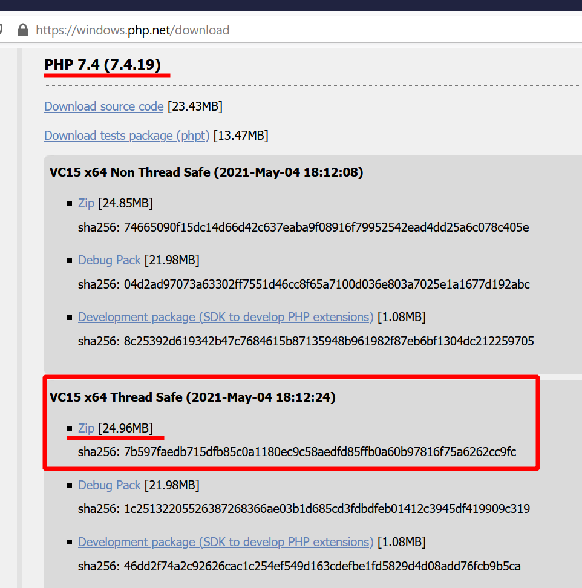
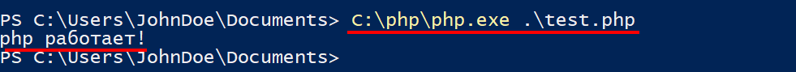
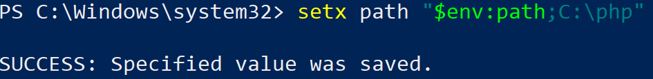
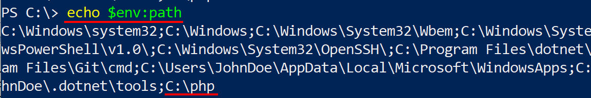
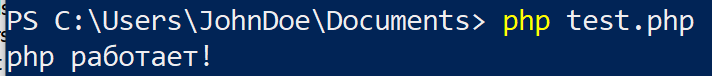
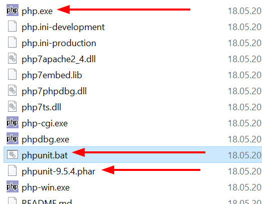
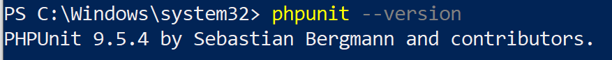
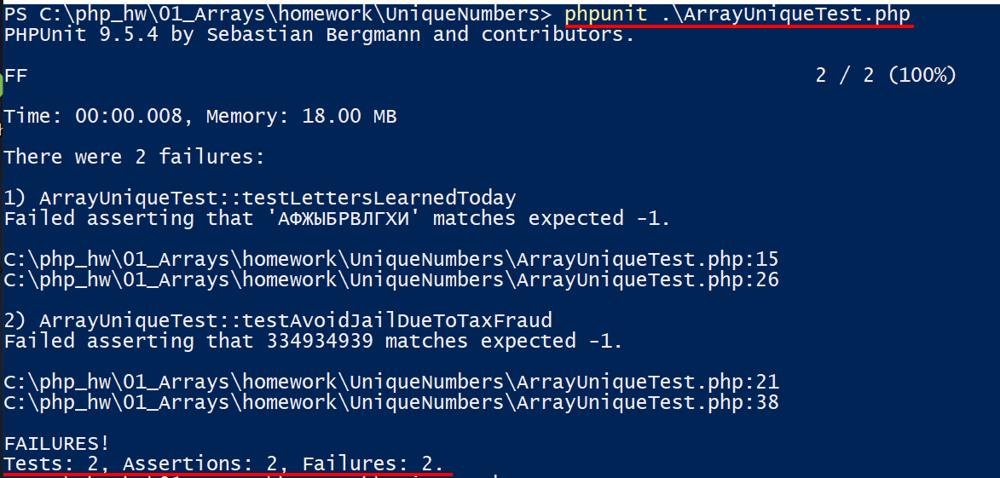

+++
title = "Установка PHP+PhpUnit в Windows 10"
date = "2021-05-18"
author = "Konstantin Shibkov"
readingtime = 55
tags = ["php", "phpunit", "install"]
+++

Для запуска тестов используя фреймворк PhpUnit нам нужен сам PHP, если его нет, то установим.

Если у вас есть PHP в составе OpenServer, WAMP или другой сборки. Пропускайте шаг с установкой

## Установка PHP 7.x

### Скачивание

[Переходим на сайт и скачиваем последнюю версию 7.x](https://windows.php.net/download)

Нам нужна именно версию ThreadSafe, скачиваем архив zip.



Создайте папку, буду использовать `C:/php`, и в нее распакуйте содержимое архива.

Можно уже сейчас проверить работу php кода, создайте в любом месте файл `test.php` с таким содержимым:

```php
<?php
echo "php работает!";
?>
```

Запускаем передавая путь до файла c кодом интерпретатору `C:/php/php.exe`:


Мы теперь можем запускать PHP код, уже хорошо!

### Настройка PATH

Чтобы каждый раз не писать полный путь до испольняемого файла, добавить в переменную PATH путь, и тогда будет использовать только короткую запись `php .\test.php` для запуска файлов.

- 💡 рекомендуется сделать бекап ваших настроек, делается командой:

```bash
echo $env:path > backup_path.txt
```

если что пойдет не так - сможете восстановить данные из файла.

Запускайте Powershell (Администратор) и командой добавляем новый путь в PATH для текущего пользователя:

```bash
setx path "$env:path;C:\php"
```



Закройте Powershell и откройте заново, чтобы новые PATH использовался в новой сессии.
Проверяем, что путь на месте:

```bash
echo $env:path
```



и теперь запускаем скрипт так:

```bash
php test.php
```



Успех!

## Установка PhpUnit

Скачиваем phar архив https://phar.phpunit.de/phpunit.phar

копируйте в папку с php, в нашем случае это `C:\php` и создайте `phpunit.bat` в этой же директории:



содержимое файла

```bash
@php "%~dp0phpunit-9.5.4.phar" %*
```

- 💡 Укажите точное название файла, который скоприровали, чтобы версии совпадали.

Проверяем:

```bash
phpunit --version
```



Это явный признак успешной установки! 👍

## Запуск тестов

Для запуска тестов из консоли, выполните команду

```bash
phpunit "файл_с_тестами"
```

Пример запуска тестов:



Судя по скриншоту, тесты испольняются, теперь их предстоить только удовлетворить. А это уже другая история 🙂

## Полезные ссылки

- [PhpUnit Manual](https://phpunit.readthedocs.io/en/latest/index.html)
