Давайте признаемся, что подавляющее большинство пишет Java код используя
JetBrains IDEA. Да, это отличная IDE. Для нее есть большое количество расширений,
среда очень тесно интегрируется и знает особенности Spring Framework.

А еще есть Community версия, так что можно даже не платить за основной функционал.

Тогда зачем пробовать что-то другое?

В какой-то мере все Java разработчики стали заложниками, так как IDEA так
обволакивает и нет желания пробовать другое, ведь все такое удобное, знакомое.

Поэтому в этой статье делюсь опытом изучения вопроса "А можно ли перейти на VSCode?".

Какие боли, а может и радости при этом испытываешь.

## Точка старта

Начнем с того, какие базовые условия разработки имеются сейчас. И чем пользуюсь часто,
для чего есть интеграции в IDEA:

- Java 17/21 + Kotlin
- Spring Boot 3
- использование spring initializr (публичный и корпоративный)
- многомодульные Maven/Gradle проекты
- Postgres
- MyBatis для работы с БД
- Junit 5 + AssertJ
- Copilot
- Документация в MarkDown + AsciiDoc + PlantUML
- Kubernetes

Попробуем найти аналоги или возможно для VSCode есть точно такие же расширения.

## Установка VSCode и расширений

⬇️ 

⚠️ Вы можете повторить все действия на любой ОС. Надо учесть:

- Если у вас Windows - желательно использовать WSL 2 для работы с Linux среде
- Если у вас Linux/macOS все действия выполняются локально.
- Если у вас установлен Code - OSS в Arch/Manjaro или дистрибутив основанный на Arch, чтобы включить официальный магазин расширений VSCode установите из AUR `pamac install code-marketplace`. Это позволит избежать ошибку при установке расширений `Extension 'tinhn90.flyway-migration-helper' not found.`

После установки:

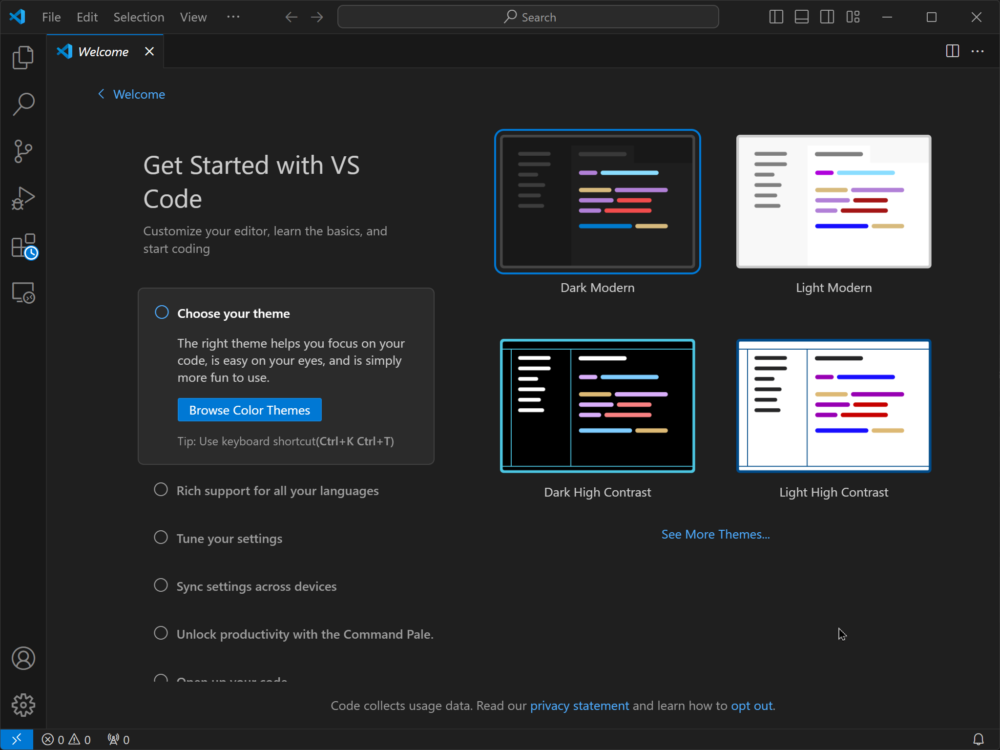

Особенность работы через WSL заключается к том, что VSCode у вас будет как бы
дублирован. Одна версия VSCode будет установлена в Windows, а другая в WSL.
Это позволяет работать в среде Linux не выходя из Windows и не используя GUI Linux.

По простому - в Windows у вас будет клиент, а все действия будут выполняться в WSL,
то есть в Linux. Наборы расширений ставятся и настраиваются отдельно
для WSL VSCode и для Windows VSCode. Вам необходимо ставить расширения после подключения
к WSL.

В Windows откройте VSCode и подключитесь к WSL, есть разные способы:

- нажать на значок в нижнем левом углу, с иконкой `><`
- вызвать палитру команд <kbd>CTRL</kbd> + <kbd>SHIFT</kbd> + <kbd>P</kbd>

и выбрать <mark>Connect to WSL using Distro...</mark>,
после выбрать дистрибутив WSL.

Скачается серверная часть VSCode, которая будет работать в WSL, а в Windows останется только тонкий клиент

### Extension Pack for Java

Ставим минимальный набор расширений для Java. Это позволит
проверять синтаксис, подсвечивать код,
использовать автокомплит, включит инструменты рефакторинга, режим дебага,
запускать JUnit тесты.

Устанавливать расширения можно перейдя по ссылке или через поиск в разделе EXTENSIONS.

<a href="https://marketplace.visualstudio.com/items?itemName=vscjava.vscode-java-pack"
target="_blank">Extension Pack for Java</a>

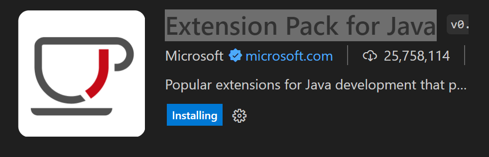

### SonarLint

Анализ кода, куда же без него. Ставим расширение SonarLint. Оно будет давать подсказки
по коду, а также позволяет подключить SonarQube сервер и выполнять проверки проекта
с получением отчета. Ссылка на расширение:

<a href="https://marketplace.visualstudio.com/items?itemName=SonarSource.sonarlint-vscode"
target="_blank">SonarLint</a>

Возможно потребуется установка Node.js. Найдете подробности на странице https://github.com/nodesource/distributions

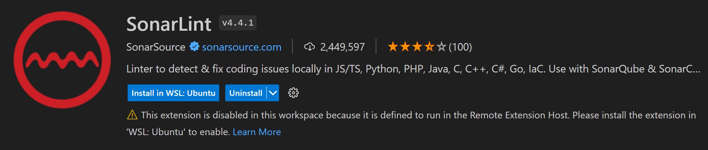

Для подключения SonarQube сервера, следуйте по инструкции на скриншоте. Достаточно ввести
адрес сервера, дальше получение токена будет произведено автоматически через авторизацию
в браузере.

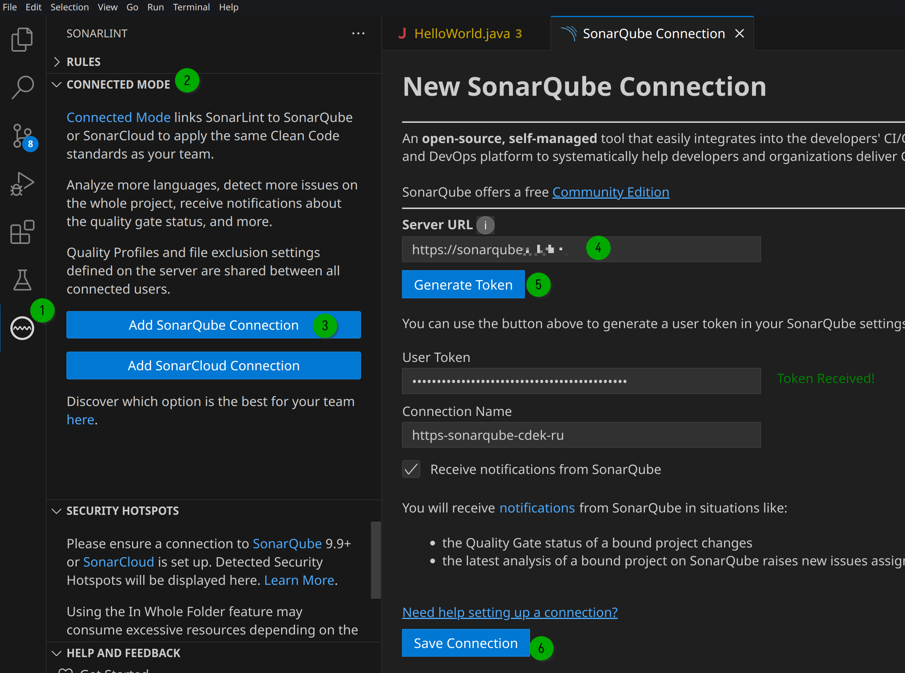


### 🧪 Промежуточная проверка

А теперь можно проверить как запускает Java код на этом этапе. Сделаем простой Hello, world!

У вас уже должен быть установлен JDK. Для Windows - JDK необходимо установить в WSL среде.
Самый простой способ это использовать утилиту <a href="https://sdkman.io/" target="_blank">SdkMan</a>.

Создайте файл `HelloWorld.java`

```bash
touch HelloWorld.java
```

и запишите в него код:

```java
class HelloWorld {
    public static void main(String[] args) {
        System.out.println("Hello World!");
    }
}
```

> В Linux / macOS достаточно открыть файл `HelloWorld.java`,
дополнительных действий не требуется

В Windows откройте VSCode и подключитесь к WSL, есть разные способы:

- нажать на значок в нижнем левом углу, с иконкой `><`
- вызвать палитру команд <kbd>CTRL</kbd> + <kbd>SHIFT</kbd> + <kbd>P</kbd>

и выбрать <mark>Connect to WSL using Distro...</mark>,
после выбрать дистрибутив WSL.

Скачается серверная часть VSCode, которая будет работать в WSL,
а в Windows останется только тонкий клиент

Открывайте файл `HelloWorld.java` и запускайте через:

- Run ▸ Run Without Debugging...
- <kbd>CTRL</kbd> + <kbd>F5</kbd> / <kbd>⌃</kbd> + <kbd>F5</kbd>
- Нажать на символ Play, отмечен на скриншоте.

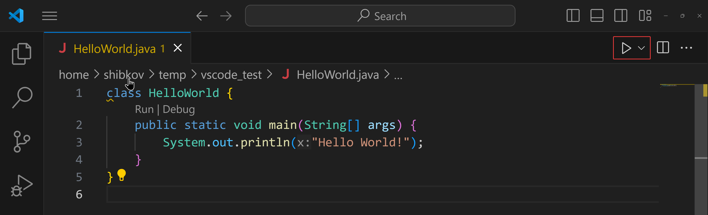

Если JDK установлен - то файл исполнится. Также можете проверить debug, установка
breakpoint также левее от номера строки и в подменю запускаете в режиме debug.

Пора двигаться дальше.

### Spring Boot Extension Pack

В него входит Spring Tools для работы с кодом, который использует Spring.
Spring Initializr для упрощения создания нового проекта. Spring Dashboard
для управления Spring Boot проектами: запуск приложения, список ендпоинтов, дебаг.

<a href="https://marketplace.visualstudio.com/items?itemName=vmware.vscode-boot-dev-pack"
target="_blank">Spring Boot Extension Pack</a>

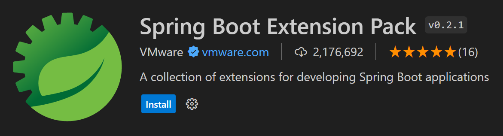

После установке будет предложено создать пример проекта, для тестирования
расширения. Будет склонирован проект PetClinic в выбранную директорию.

Предлагаю так и сделать: создать проект, запустить, убедиться
что все работает. После клонирования, необходимо будет подождать
пока проект проиндексируются и будут скачены все зависимости.

Чтобы создать новый Java проект, перейдите в EXPLORER вкладку и найдите
кнопку создать новый проект. А дальше в интерактивном меню вы можете выбрать
тип проекта и какими средствами его создать, включая Spring Initializr.

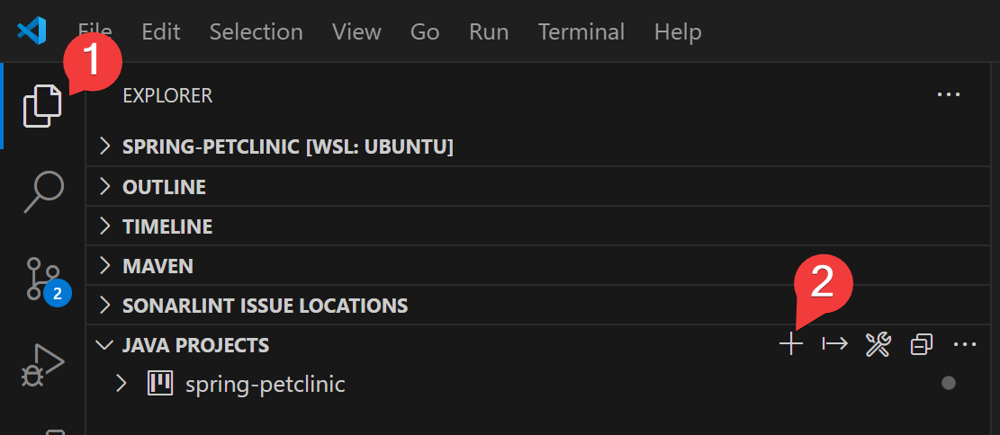

#### Как добавить корпоративный Spring Initializr

Возможно настроить использование инициализации проекта с указанием
сервера сборки шаблонного проекта.

Перейдите в настройки расширения Spring Initializr. Мне удобно это делать
через палитру действий, кликнув на шестеренку:

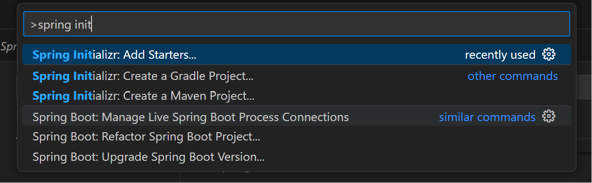

Находите пункт Service Url, заходите в редактирование `settings.json` и прописывайте
свое значение URL в параметр `"spring.initializr.serviceUrl"`. Сохраняйте файл и теперь создавайте проекты используя
свой сервис сборки проектов.

### Рекомендуемые расширения

- <a href="https://marketplace.visualstudio.com/items?itemName=vscjava.vscode-gradle"
target="_blank">Gradle for Java</a>
- <a href="https://marketplace.visualstudio.com/items?itemName=GoogleCloudTools.cloudcode"
target="_blank">Google Cloud Code (для k8s)</a>
- <a href="https://marketplace.visualstudio.com/items?itemName=jebbs.plantuml"
target="_blank">PlantUML</a>
- <a href="https://marketplace.visualstudio.com/items?itemName=asciidoctor.asciidoctor-vscode"
target="_blank">AsciiDoc</a>
- <a href="https://marketplace.visualstudio.com/items?itemName=GitLab.gitlab-workflow"
target="_blank">GitLab Workflow - CR/CI/MR</a>
- <a href="https://open-vsx.org/extension/phil294/git-log--graph"
target="_blank">git-log--graph - визуализация веток и коммитов, cherry-pick и т.д.</a>
- <a href="https://marketplace.visualstudio.com/items?itemName=ms-azuretools.vscode-docker"
target="_blank">Docker</a>
- <a href="https://marketplace.visualstudio.com/items?itemName=ms-kubernetes-tools.vscode-kubernetes-tools"
target="_blank">Kubernetes</a>
- <a href="https://marketplace.visualstudio.com/items?itemName=Arjun.swagger-viewer"
target="_blank">Swagger Viewer</a>
- 
- 
- 
- 
- 
- 
- 
- 
- 
- 
- 
- 


### Расширения для переноса своего JetBrains опыта

Перенесите хоткеи, к которыми привыкли:
- <a href="https://marketplace.visualstudio.com/items?itemName=k--kato.intellij-idea-keybindings"
target="_blank">IntelliJ IDEA Keybindings</a>

Другие хоткеи вы можете настроить открыв полный список хоткеев File -> Preferences -> Keyboard Shortcuts

Если вам поможет тема из IDEA, тут она тоже есть:
- <a href="https://marketplace.visualstudio.com/items?itemName=trinm1709.dracula-theme-from-intellij"
target="_blank">Darcula IntelliJ Theme</a>

Вы смотрите на файлы и не понимаете что иконки означают - верните привычный вид:
- <a href="https://marketplace.visualstudio.com/items?itemName=lijialin.IDEA-Icons-To-Maven-For-VSCode"
target="_blank">IDEA Icons in VSCode</a>

### Настройки

Часть настроек можно делать в графическом интерфейсе, его можно открыть разными способами:

- хоткей <kbd>CTRL</kbd> + <kbd>,</kbd> / <kbd>⌘</kbd> + <kbd>,</kbd>
- в меню File -> Preferences -> Settings
- откройте консоль быстрого доступа <kbd>CTRL</kbd> + <kbd>SHIFT</kbd> +  <kbd>P</kbd> /
<kbd>⌘</kbd> + <kbd>SHIFT</kbd> + <kbd>P</kbd>, введите `settings` и выберите <mark>Open Settings</mark>

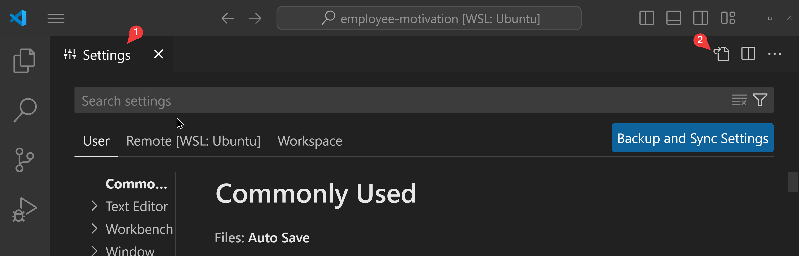

Также прописывать настройки в виде текста в json файле конфигурации:
- откройте UI настроек и сверху справа у вас будет кнопка <mark>Open Settings (JSON)</mark>
- откройте консоль быстрого доступа и выберите пункт <mark>Open User Settings (JSON)</mark>

#### Включить автосохранение файлов

- откройте настройки
- найдите пункт <mark>Auto Save</mark>
- установите значение в <mark>onFocusChange</mark> или <mark>afterDelay</mark> или другое, подходящее для вас.

JSON формат

```json
{
    "files.autoSave": "afterDelay"
}
```

#### Всегда открывать папки в новом окне

Новый проект или отдельный файл - новое окно IDE?
Eсли и вам так удобно - устанавливайте параметры

```json
{
    "window.openFilesInNewWindow": "on",
    "window.openFoldersInNewWindow": "on"
}
```

#### Всегда открывать папки в новом окне

Новый проект или отдельный файл - новое окно IDE?
Eсли и вам так удобно - устанавливайте параметры

```json
{
    "window.openFilesInNewWindow": "on",
    "window.openFoldersInNewWindow": "on"
}
```

#### Настройки шрифта

Любимый и привычный шрифт и размер - это точно важно,
а еще можно лигатуры включить:

```json
{
    "editor.fontFamily": "'Iosevka', 'Droid Sans Mono', 'monospace', monospace",
    "editor.fontSize": 14,
    "editor.fontLigatures": true
}

#### Кнопки схлопывания, folding

По умолчанию, около каждого метода или класса стрелочки для раскрытия или
сокрытия содержимого появляются только при наведении на них. Чтобы сделать их всегда
видимыми:

```json
{
    "editor.showFoldingControls": "always"
}
```

#### Настройка Git

Включите autofetch и вы всегда будете в курсе изменения в репозитории:

```json
{
    "git.autofetch": true,
    "git.autofetchPeriod": 300
}
```

autofetchPeriod задается в секундах

### Настроить сервер для Spring Initalizr

Укажите URL сервера в парметре:

```json
{
 "spring.initializr.serviceUrl": [
        "https://spring-initializr.my-company.ru"
    ]
}
```

#### AsciiDoc + PlantUML

Чтобы PlantUML отрисовывался в AsciiDoc, необходимо активировать kroki
и указать PlantUML сервер:

И добавить параметр:

```json
{
    "asciidoc.extensions.enableKroki": true,
    "plantuml.server": "https://www.plantuml.com/plantuml"
}
```

вы можете использовать корпоративный сервер или локальный сервер для отрисовки.
Или оставить значение, как в примере, тогда будете использовать публичный сервер.

#### Gitlab

Для подключения Self Hosted Gitlab необходимо:
- сгенерируйте токен для доступа к api. Для этого перейдите в настройки (Preferences) профиля в GitLab,
далее в пункт Access Tokens, создайте новый токен и выберите scopes: api и read_api, скопируйте токен.
- перейдите в расширение GitLab Workflow, нажмите Add Account. Введите адрес GitLab и в следующем
предложении ввода вставьте токен.

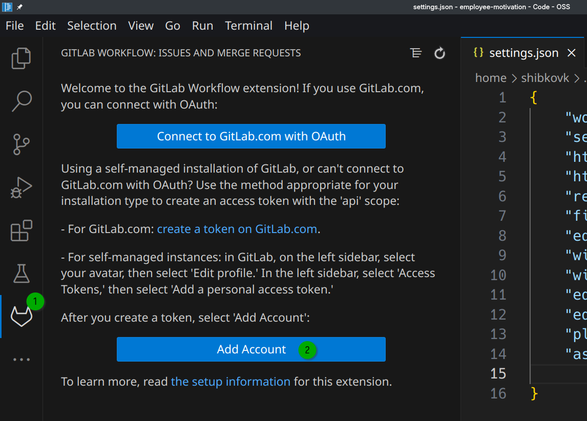

После успешного добавления связи с GitLab, у вас появляются возможности:

- получать списки MR, с фильтрацией
- выполнять Code Review с написанием комментариев к измененным строкам
- видеть результат выполнения Pipelines MR

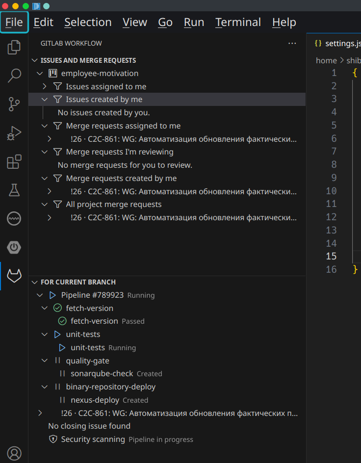

Также будет возможно поставить Approve для MR.

#### Удаленный Java Debug

Мне например удобно всегда запускать приложение с возможностью подключиться в режиме Debug.
Чтобы сделать это в VSCode создайте конфигурацию запуска launch.json

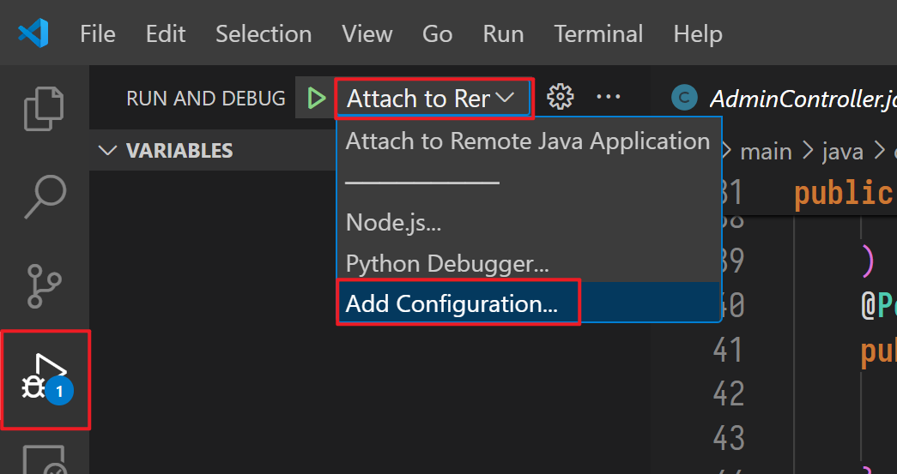

Вставьте конфиг, при необходимости измените хост и порт.

```json
{
    "version": "0.2.0",
    "configurations": [
        {
            "type": "java",
            "name": "Attach to Remote Java Application",
            "request": "attach",
            "hostName": "127.0.0.1",
            "port": 5005
        }
    ]
}
```

- `hostName` - адрес хоста, где развернуто приложение
- `port` - это порт для подключения удаленного дебага

Запускайте дебаг сессию после запуска приложения.

### Активировать внешние правила оформления кода

Скачайте файл с правилами по оформлению кода

```bash
wget https://raw.githubusercontent.com/google/styleguide/gh-pages/eclipse-java-google-style.xml
```

Укажите в настройках параметр c указанием пути до файла:

```json
{
    "java.format.settings.url": "/home/shibkov/dev/eclipse-java-google-style.xml"
}
```

### GitHub Copilot

Для подключения надо войти в свою учетную запись и связать с IDE.

Нажмите на иконку Copilot в статусной строке и выберите Sign In

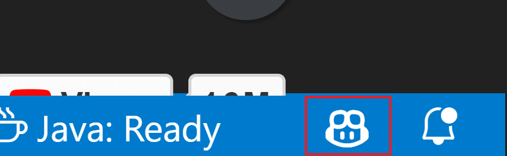

Если возникают проблемы с подключением, ошибка доступа. Обычно помогает
выйти и зайти в свой аккаунт.

Для выхода из GitHub аккаунта:

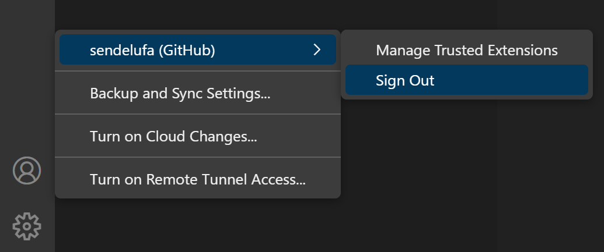

## Что в итоге получилось?

После всех действий у вас под рукой настроенная для разработки Java приложений с
использованием Spring Boot.

Дальше вы можете настраивать IDE под ваши нужды, находить полезные расширения для
решения ваших задач. Так вы сможете по кирпичикам собрать свою IDE.

Удачной разработки!
