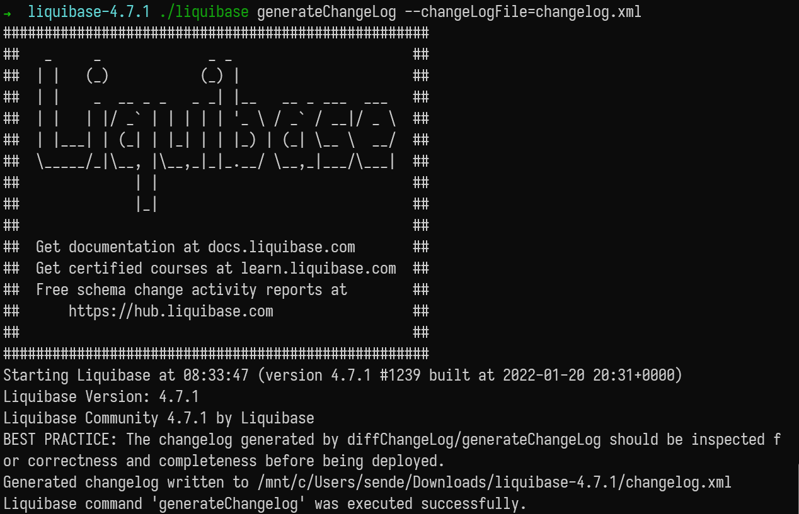

Разберем частый вопрос:

- есть приложение, у него есть подключение к БД
- требуется внедрить миграцию баз данных Liquibase.

С чего начать?

Существуют два подхода

- Ленивый (не рекомендуется). Подключить в проект Liquibase и считать, что существующая
структура БД это базовое состояние. И далее поверх уже писать [новые миграции]().

- Начать с нуля. Существующая структура базы данных конвертируется в
changeset. Сохраняются данные БД. Структура накатывается с нуля уже через Liquibase. После возвращаются данные в БД.

В этой статье пойдем по рекомендуемому пути и только получим changeset из
рабочей базы данных.

## TL;DR

Команда для создания changelog в формате SQL для Postgres:

```bash
liquibase generateChangeLog \
    --driver=org.postgresql.Driver \
    --url=jdbc:postgresql://localhost:5432/postgres \
    --username=postgres \
    --password=password \
    --changeLogFile=changelog.postgresql.sql
```

## Необходимые инструменты

Для повторения всех действий вам понадобится:

- Docker или развернутый сервер PostgreSQL 10+
- [архив с Liquibase](https://liquibase.org/download) - устанавливать необязательно
- консоль

## Существующая бд

Для удобства БД предоставляю в двух видах:

1. Docker контейнер, с уже настроенной БД. Для запуска достаточно выполнить:

```bash
docker run -d -p 5432:5432 sendel/postgres_for_liquibase
```

- пользователь: `postgres`
- пароль: `password`
- база данных: `postgres`

2. [Дамп в виде файла sql](/files/sendel_ru_dump-postgres-liquibase.sql),
 который уже вручную можно загрузить в БД.

## Создание changeset из консоли без Java проекта

> Данный вариант удобен, так как не требуется проект с кодом.
> Достаточно только иметь подключение к БД.

Распакуйте скаченный архив с Liquibase или установите, если скачали инсталлер.

> Можете добавить путь до директории с liquibase в PATH, тогда сможете использовать
> команды liquibase без полного пути до испольняемого файла. Инсталлер это делает за 
> вас.

Откройте любимый эмулятор терминала (консоль) и перейдите в директорию
распакованного архива.

Если установили, то переходить никуда не надо.

Создайте файл `liquibase.properties` из которого Liquibase возьмет параметры для
подключения к БД. Для нашей БД в докере настройки будут такими:

```yaml
driver: org.postgresql.Driver
url: jdbc:postgresql://localhost:5432/postgres
username: postgres
password: password
```

Выполните команду для запуска Liquibase:

- Linux/macOS

```bash
./liquibase generateChangeLog --changeLogFile=changelog.xml
```

- Windows

```bash
.\liquibase.bat generateChangeLog --changeLogFile=changelog.xml
```

- `generateChangeLog` - команда для создания changelog файла.
- `--changeLogFile` - параметр, с именем файла для сохранения changelog.

Как выглядит успешная генерация:



Если у вас возникают ошибки, проверьте:

- наличие файла `liquibase.properties`
- правильно указаны параметры для подключения

> Если нет желания записывать пароль и пользователя в файл, можно использовать
> параметры командной строки:

```bash
./liquibase generateChangeLog --changeLogFile=DevDB.json \ 
--username=postgres --password=password
```

И даже вынести все параметры в команду, не используя файл настроек вовсе, например:

```bash
liquibase generateChangeLog \
    --driver=org.postgresql.Driver \
    --url=jdbc:postgresql://localhost:5432/postgres \
    --username=postgres \
    --password=password \
    --changeLogFile=changelog.postgresql.sql
```

### Как получить JSON, XML, YAML файл changelog

Формат файла changelog зависит от указанного расширения, для команды выше будет
создан XML формат. Если указать:

```bash
./liquibase generateChangeLog --changeLogFile=changelog.yaml
```

получите YAML формат. Таким образом можно получить форматы JSON, XML, YAML.
Обязательно проверьте, что вам выдал liquibase, при необходимости внесите
корректировки.

### Получение SQL формата changelog

СУБД различаются по синтаксису SQL, поэтому при генерации changelog, укажите
тип базы данных, так же в названии файла, до расширения файла. Пример:

```bash
liquibase generateChangeLog --changeLogFile=devDB.sqlite.sql
```

Другие типы бд

БД | Имя файла
---------|----------
PostgreSQL | *.postgresql.sql
MySQL | *.mysql.sql
Azure SQL  | *.mssql.sql
H2 | *.h2.sql
IBM DB2 | *.db2.sql
MariaDB | *.mariadb.sql
Microsoft SQL Server | *.mssql.sql

<a href="https://liquibase.org/get-started/databases" target="_blank">
Полный список баз данных и имен файлов.</a>

Обязательно проверьте, что вам выдал liquibase, при необходимости внесите
корректировки или удалите лишние метаданные. Возможно вы захотите поменять id
отдельных changeset.

## Полезные параметры команды liquibase generateChangeLog

> Полный список параметров <a href="https://docs.liquibase.com/commands/generatechangelog.html" target="_blank"> в официальной документации.</a>

Все параметры можно использовать в файле конфигурации `liquibase.properties`.

Параметр | Описание      | Обязательный
---------|---------------|---------
 `--changeLogFile` | Путь до файла, куда будет сохранен changelog. Если файл существует, то будет ошибка выполнения команды. | ✔
 `--url` | СсылкаJDBC для подключения к бд | ✔
`--username` | Пользователь БД | ✔
`--password` | Пароль БД | ✔
`--defaultSchemaName` | Выбор схемы в БД | ❌
`--driver` | Указание JDBC драйвера | ❌
`--dataOutputDirectory` | В указанную директорию сохранятся данные таблиц в формате CSV | ❌
`--diffTypes` | Выбрать отдельные структуры БД для создания changelog. Возможные значение, через запятую: catalog, tables, functions, views, columns, indexes, foreignkeys, primarykeys, uniqueconstraints, data, storedprocedure, triggers, sequences | ❌
`--includeSchema` | [true,false] Если true - в файле changeLog будет указана схема у таблиц. Если false - будет использоваться public. По умолчанию false |  ❌

## ⭐ Есть Hibernate код Entity, но нет БД

Если у вас уже описаны классы Entity и базу данных генерирует и обновляет Hibernate,
и вы хотите перейти на Liquibase. То достаточно запустить приложение, Hibernate вам сгенерирует или обновит структуру БД.

После этого, запускайте скрипт liquibase и получайте готовый changelog.
