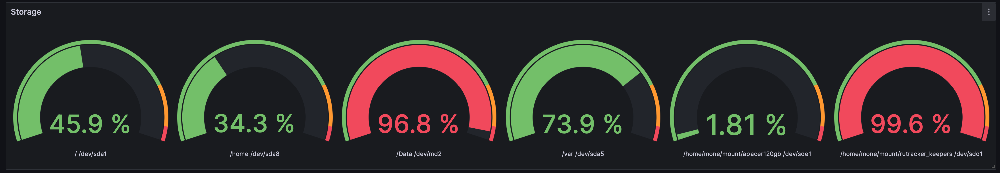
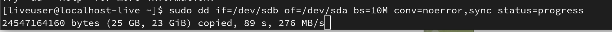
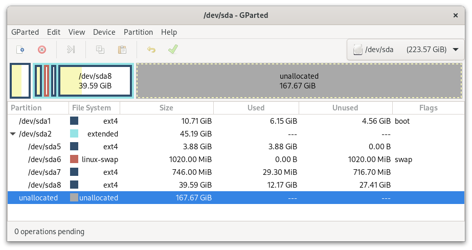
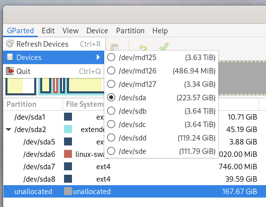
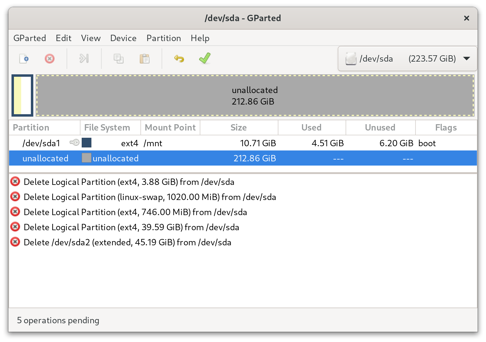
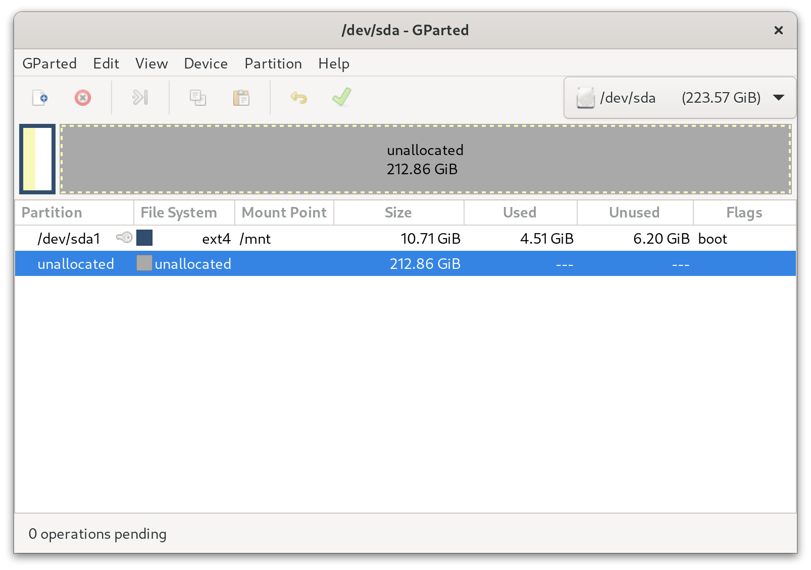
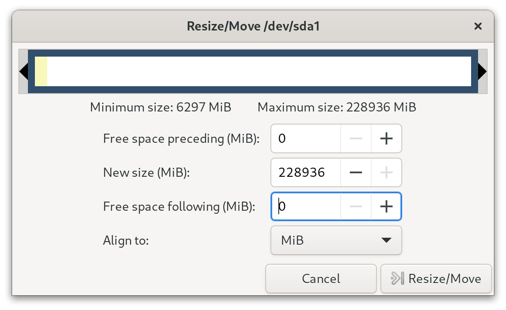
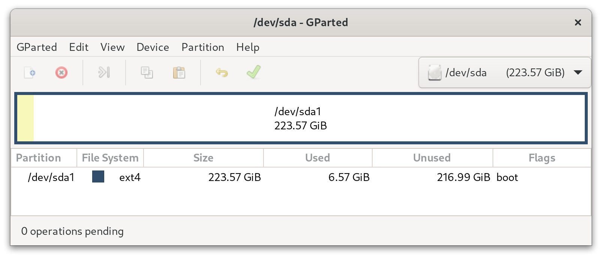

## Исходная точка

У меня есть домашний сервер. Установлен Debian 10 (buster) x86_64, ядро 4.19.0-25-amd64.

Первоначальная настройка и установка системы
была выполнена в 2016 году, в 2020 был переезд на SSD. Тогда для размещения системы
был выбран SSD на 60GB, дополнительно к этому, у меня случилось желание
разложить все по полочкам и разделил на отдельные разделы.

```bash
lsblk /dev/sda
```

```sh
sda       8:0    0  55.9G  0 disk
├─sda1    8:1    0  10.7G  0 part  /
├─sda2    8:2    0     1K  0 part
├─sda5    8:5    0   3.9G  0 part  /var
├─sda6    8:6    0  1020M  0 part  [SWAP]
├─sda7    8:7    0   746M  0 part  /tmp
└─sda8    8:8    0  39.6G  0 part  /home
```

Характеристики диска:

```text
Device Model:     SPCC Solid State Disk
LU WWN Device Id: 5 02b2a2 01d1c1b1a
Add. Product Id:  mavlsata
Firmware Version: V2.10
User Capacity:    60,022,480,896 bytes [60.0 GB]
Sector Size:      512 bytes logical/physical
Rotation Rate:    Solid State Device
ATA Version is:   ACS-3 T13/2161-D revision 4
SATA Version is:  SATA 3.2, 6.0 Gb/s (current: 1.5 Gb/s)
SMART support is: Enabled
```

Еще работает на 1.5Gb/s, мелочь, но неприятно :)

Первые пару лет проблем не было.

### Неудобство

После активного использования Docker контейнеров быстро закончилось место в /var,
через <a href="https://ru.wikipedia.org/wiki/Символическая_ссылка" target="_blank">SymLink</a>
не думая, перебросил на другой накопитель.

Жить стало проще, но со временем постоянно возвращался к решению этого вопроса и неудивительно,
/var всего-то 3.9GB. То логов много, то однажды mail для пользователей все это раздуло.

🙏 Спасибо этой ситуации! Она меня заставила установить мониторинг и получать alert до того, как диск
будет заполнен под завязку и что-то перестанет работать.



В итоге происходила постоянная адаптация к сложившейся ситуации и с этим можно было жить,
так как времени не находилось изменить структуру диска и все положить в / и не париться.

### Проблема

В один прекрасный день, мне сообщают, что открывается страница облачного хранилища с ошибкой 500,
бот в телеге не отвечает и так далее.

Пытаюсь зайти на сервер по SSH - не могу, просит какой-то пароль 🥴.

Ну ладно, в итоге пошел самым простым путем - сделал ребут. После этого попытался снова зайти - все ок.

Как оказалось, системный диск перешел в режим RO (Read only), что позволило ему частично продолжить работу.

Анализ SSD через `smartctl` ничего не дал (мне), попросил ChatGPT трактовать - он тоже сказал: "ОКЭЙ"!

```sh
=== START OF READ SMART DATA SECTION ===
SMART overall-health self-assessment test result: PASSED

SMART Attributes Data Structure revision number: 5
Vendor Specific SMART Attributes with Thresholds:
ID# ATTRIBUTE_NAME          FLAG     VALUE WORST THRESH RAW_VALUE
  5 Reallocated_Sector_Ct   0x0033   100   100   010    0
  9 Power_On_Hours          0x0033   100   100   010    26383
 12 Power_Cycle_Count       0x0033   100   100   010    78
176 Erase_Fail_Count_Chip   0x0033   100   100   010    0
177 Wear_Leveling_Count     0x0033   100   100   010    0
178 Used_Rsvd_Blk_Cnt_Chip  0x0033   100   100   010    0
192 Power-Off_Retract_Count 0x0033   100   100   010    0
194 Temperature_Celsius     0x0033   100   100   010    42
195 Hardware_ECC_Recovered  0x0033   100   100   010    0
199 UDMA_CRC_Error_Count    0x0033   100   100   010    0
241 Total_LBAs_Written      0x0033   100   100   010    9423
242 Total_LBAs_Read         0x0033   100   100   010    22437
```

Три года безостановочной работы, показания сходятся. А вот
показания всего прочитано/записано низкие.

Да и падение в RO режим происходит редко и прям не бросался решать проблему,
пока в логах не увидел часто:

```log
[38224.429890] ata1.00: failed command: WRITE FPDMA QUEUED
[38224.431441] ata1.00: cmd 61/08:08:88:ba: 56/00:00:01:00:00/40 tag 21 ncq dma 4096 out
[38224.431441] res 40/00:ac:a8:ba: 56/00:00:01:00:00/40 Emask 0x10 (ATA bus error)
[98224.494548] ata1.00: status: { DRDY } [
[38224.768690] ata1.00: exception Emask 0x10 SAct 0x40000001 SErr 0x400100 action 0x6 frozen
[38224.775660] ata1.00: irq_stat 0x08000000, interface fatal error
[38224.777663] ata1: SError: { UnrecovData Handshk } [38224.779655] ata1.00: failed command: WRITE FPDMA QUEUED
[38224.781652] ata1.00: cmd 61/38:00:88:4f:8f/00:00:01:00:00/40 tag 0 ncq dma 28672 out
[38224.781652] res 40/00:04:88:4f:8f/00:00:01:00:00/40 Emask 0x10 (ATA bus error)
[38224.785647] ata1.00: status: { DRDY }
[38224.787201] ata1.00: failed command: WRITE FPDMA QUEUED
```

смотрим что за диск (хотя по 1.00 уже намекает что это sda), в любом случае надо проверить:

```bash
ls -l /dev/disk/by-path/
```

Видим что ata1 → sda

```bash
lrwxrwxrwx 1 root root  9 Nov 28 00:41 pci-0000:00:1f.2-ata-1 -> ../../sda
lrwxrwxrwx 1 root root 10 Nov 28 00:41 pci-0000:00:1f.2-ata-1-part1 -> ../../sda1
lrwxrwxrwx 1 root root 10 Nov 28 00:41 pci-0000:00:1f.2-ata-1-part2 -> ../../sda2
lrwxrwxrwx 1 root root 10 Nov 28 00:41 pci-0000:00:1f.2-ata-1-part5 -> ../../sda5
lrwxrwxrwx 1 root root 10 Nov 28 00:41 pci-0000:00:1f.2-ata-1-part6 -> ../../sda6
lrwxrwxrwx 1 root root 10 Nov 28 00:41 pci-0000:00:1f.2-ata-1-part7 -> ../../sda7
lrwxrwxrwx 1 root root 10 Nov 28 00:41 pci-0000:00:1f.2-ata-1-part8 -> ../../sda8
```

👋 Так что пришло время заменить SSD на новый, большой и быстрый.

🤓 А у меня есть интересная задачка по переносу системы на новый диск с требованиями:

- переезд на 240GB и возврат системных директорий на место с других дисков
- никаких отдельных разделов, все будет в /
- система должна продолжить работу как ни в чем не бывало.

## Погнали!

### План действий

Есть несколько вариантов как сделать миграцию на новый диск.

Выбрал следующий путь:

1. Проверить, что файл /etc/fstab используют UUID устройств для монтирования, таким
образом все диски даже если изменять свои месторасположения - все равно найдутся, смонтируются
и не придеться после переноса изменять fstab.
2. Выключить сервер
3. Отключить все накопители, что не участвуют в переносе
4. Вставить новый SSD в SATA 1 (где стоял старый)
5. Старый SSD вставлю в свободный SATA
6. Подключаю к серверу моник, клаву
7. Загружаюсь с LiveUSB
8. Переношу с помощью утилиты dd старый диск на новый.
9. Удаляю разделы /var /home /tmp с нового диска
10. Расширяю / до максимума
11. Проверяю работоспособность

Если что-то пойдет не так, у меня все еще есть оригинальный диск.

Для LiveUSB просто скачал 
<a href="https://ubuntu.com/download/desktop" target="_blank">Ubuntu 22.04.3 LTS</a>,
можно использовать специализированные сборки. Обычный образ установки Ubuntu подходит, ведь
в нем есть режим (Try) Попробовать ОС без установки - им и буду пользоваться. Еще у меня всегда
под рукой есть Fedora LiveUsb, тоже подходит.

В моем случае особых инструментов не потребуется. Утилиты dd, resize2fs, parted,
fdisk есть в любом дистрибутиве.

Закинул на внешний жесткий на которому уже установлен
<a href="https://www.ventoy.net/en/index.html" target="_blank">Ventoy</a>
(позволяет держать множество образов на внешнем диске и выбирать какой образ использовать)

Распаковал новый SSD и подключил на место существующего SSD с системой,
старый SSD на другой порт воткнул.

Загружаюсь с LiveUSB.

### Проверяем обстановку

У нас должны быть обязательно доступны оба устройства:

- Старый SSD в дальнейшем Источник
- Новый SSD в дальнейшем Цель

Проверяем, что все участники на месте:

```bash
lsblk
```

```bash
NAME        MAJ:MIN RM   SIZE RO TYPE MOUNTPOINTS
loop0         7:0    0   1.9G  1 loop 
loop1         7:1    0   7.6G  1 loop 
├─live-rw   253:1    0   7.6G  0 dm   /
└─live-base 253:2    0   7.6G  1 dm   
loop2         7:2    0    32G  0 loop 
└─live-rw   253:1    0   7.6G  0 dm   /
sda           8:0    0 223.6G  0 disk 
sdb           8:16   0  55.9G  0 disk 
├─sdb1        8:17   0  10.7G  0 part 
├─sdb2        8:18   0     1K  0 part 
├─sdb5        8:21   0   3.9G  0 part 
├─sdb6        8:22   0  1020M  0 part 
├─sdb7        8:23   0   746M  0 part 
└─sdb8        8:24   0  39.6G  0 part 
sdc           8:32   0 111.8G  0 disk 
├─sdc1        8:33   0 111.8G  0 part 
└─sdc2        8:34   0    32M  0 part 
zram0       252:0    0     8G  0 disk [SWAP]
```

Определяем наши диски:

- Источник это `sdb`
- Цель это `sda`.

Мы будем переносить из `sdb` → `sda`.

> <i class="fas fa-info-circle"></i> Важно не перепутать эти имена,
> а то можно потерять всю инфу на накопителях.

### Переносим всю структуру диска с помощью dd

📢 Убедитесь, что `sda` и `sdb` не смонтированы, это можно проверить одной из команд:

```bash
mount | grep /dev/
```

или мне больше нравится

```bash
df
```

Смотрю вывод - не вижу ни `sda` ни `sdb`.
Можно двигаться дальше.

Команда побайтового копирования дисков выглядит следующих образом:

```bash
sudo dd if=/dev/sdb of=/dev/sda bs=10M conv=noerror,sync status=progress
```

где

- `if` - input file, Источник. В нашем случае это sdb
- `of` - output file, Цель. В нашем случае это sda
- `bs` - number of bytes, по сколько байт будет переноситься за раз. Если не указывать, то по умолчанию используется 512KB. Если происходит ошибки при значении отличном от 512КB, то используйте
значение по умолчанию, то есть удалите этот параметр.
- `conv=noerror,sync` - eсли при чтении источника возникают ошибки чтения, conv=sync,noerror необходимо, чтобы предотвратить остановку dd при ошибке. 
- `status` - для вывода данных о прогрессе операции.

> <i class="fas fa-info-circle"></i> После ввода команды прочитайте внимательно, проверьте
> что все на своих местах и запускайте



От размера диска и его скорости чтения/записи зависит время копирования.
Тут возможно придеться подождать.

Результат успешного выполнения команды:

```bash
sudo dd if=/dev/sdb of=/dev/sda bs=10M conv=noerror,sync status=progress

60020490240 bytes (60 GB, 56 GiB) copied, 350 s, 171 MB/s 
5724+1 records in
5725+0 records out
60030976000 bytes (60 GB, 56 GiB) copied, 397.841 s, 151 MB/s
```

Командой `lsblk` проверяю и вижу две одинаковые структуры:

```bash
sda           8:0    0 223.6G  0 disk 
├─sda1        8:1    0  10.7G  0 part 
├─sda2        8:2    0     1K  0 part 
├─sda5        8:5    0   3.9G  0 part 
├─sda6        8:6    0  1020M  0 part 
├─sda7        8:7    0   746M  0 part 
└─sda8        8:8    0  39.6G  0 part 
sdb           8:16   0  55.9G  0 disk 
├─sdb1        8:17   0  10.7G  0 part 
├─sdb2        8:18   0     1K  0 part 
├─sdb5        8:21   0   3.9G  0 part 
├─sdb6        8:22   0  1020M  0 part 
├─sdb7        8:23   0   746M  0 part 
└─sdb8        8:24   0  39.6G  0 part
```

> <i class="fas fa-info-circle"></i> При использовании dd копируется UUID устройства,
> это стоит учитывать. Это может привести к ошибкам в работе.

Можно попробовать выключить компьютер, после этого отключить Источник
LiveUSB и попробовать загрузиться с нового SSD. Для пущей убедительности
так и сделал - все работает.

Из личных бонусов - теперь система работает на SSD со скоростью 6Gb/s. Приятно :)

😊 Первый шаг выполнен успешно!

### Избавляемся от лишних разделов

Для начала, посмотрим что у нас есть



а нам надо только один / раздел, те разделы что удалим, будут директориями
в /.

Тут стоить сделать ремарку про бекап данных, но в нашем случае
у нас есть исходный SSD, с которого мы возьмем данные вместо
удаленных разделов. А места в текущем / недостаточно чтобы в нем разместить
разделы /tmp /var /home до их удаления.

Поэтому порядок действий следующий:

1. Удаляем лишние разделы /var, /tmp, /home
2. Расширим раздел / на весь накопитель
3. Перенесем данные /var, /home из Источника в новый / раздел
4. Удалим записи монтирование разделов /var, /tmp, /home
5. Создадим swapfile в замен отдельного swap раздела

Все действия будем проводить из под LiveUSB.

> <i class="fas fa-info-circle"></i> Если не надо удалять лишние разделы,
> а только увеличить раздел / до максимального
> размера, то можно сразу переходить к пункту 2 и на нем остановиться.

1. Выбираем Целевой диск для работы в Gparted:



Выбираем раздел и нажимаем 'Delete the selected partition'.

Разделы не подписаны, определить раздел можно по его размеру
или смонтировав / и прочитать /etc/fstab файл.

Давайте это сделаем командой

```bash
sudo mount -o ro /dev/sda1 /mnt
```

выбрал sda1 на основе размера.

Читаем /etc/fstab

```bash
UUID=00c6526d-43c1-424b-9b14-c407da0f3a38 /               ext4    errors=remount-ro 0       1
UUID=bd3ef362-6392-4b14-8be8-7539680edcf8 /home           ext4    defaults        0       2
UUID=8e5de373-ad8e-4038-af8f-5792c108862d /tmp            ext4    defaults        0       2
UUID=7a1cfc99-8a56-44ce-90a4-2b766c8611d1 /var            ext4    defaults        0       2
UUID=1f89d1bd-bd28-4005-a83b-2e24289e02aa none            swap    sw              0       0
```

и через

```bash
ls -l /dev/disk/by-uuid/
```

```bash
rwxrwxrwx. 1 root root 10 Dec  1 14:49 00c6526d-43c1-424b-9b14-c407da0f3a38 -> ../../sda1
lrwxrwxrwx. 1 root root 10 Dec  1 14:49 1f89d1bd-bd28-4005-a83b-2e24289e02aa -> ../../sda6
lrwxrwxrwx. 1 root root 10 Dec  1 14:49 7a1cfc99-8a56-44ce-90a4-2b766c8611d1 -> ../../sda5
lrwxrwxrwx. 1 root root 10 Dec  1 14:49 8e5de373-ad8e-4038-af8f-5792c108862d -> ../../sda7
lrwxrwxrwx. 1 root root 10 Dec  1 14:49 bd3ef362-6392-4b14-8be8-7539680edcf8 -> ../../sda8
```

Находим по UUID раздел, и видим, что нам надо удалить sda5, sda6, sda7, sda8.
В моем случае еще надо удалить sda2, так как в нем содержались все указанные разделы.

Перед исполнением изменений в структуре диска, окно Gparted выглядит таким образом:



> <i class="fas fa-info-circle"></i> Убедитесь, что у вас есть оригинальный данные на диске Источнике
> или вы сделали бэкап этих разделов.

Применяем изменения диска, нажав на красивую зеленую галочку.

В итоге получаем:



2. Расширяем / до максимального размера

Не выходя из Gparted, выбираем из контекстного меню раздела /
пункт 'Resize/Move' и ставим Free Space following на 0 если не нужен swap
раздел или ставим значение будущего swap.

У меня не будет swap раздела, а будет использовать swap файл. Поэтому устанавливаю
значение 0. Для удобства можно использовать ползунок сверху.



Подтверждаем выбор и после применяем изменения.

Итоговый результат:



3. Переносим данные /var, /home из Источника в новый / раздел

Нам нужен подключенный диск Источник. Все действия
также продолжают выполняться в LiveUSB.

Создаем директории и монтируем разделы /var /home
в режиме чтения:

```bash
sudo mkdir -p /mnt/old/var
sudo mkdir -p /mnt/old/home
```

```bash
sudo mount -o ro /dev/sde5 /mnt/old/var
sudo mount -o ro /dev/sde8 /mnt/old/home
```

Монтируем корневой раздел обновленного Целевого диска
в режиме записи.

```bash
mkdir -p /mnt/new/root
sudo mount /dev/sda1 /mnt/new/root
```

Копируем через rsync /var /home на Целевой раздел

```bash
sudo rsync -aAXv /mnt/old/var /mnt/new/root
sudo rsync -aAXv /mnt/old/home /mnt/new/root
```

Проверьте что файлы находятся на своих местах простым ls.

4. Удаляем записи монтирование разделов /var, /tmp, /home, swap

Редактируем на Целевом root файл /etc/fstab

```bash
sudo nano /mnt/new/root/etc/fstab
```

Каждую строчку с правилом монтирования /var, /tmp, /home, swap
необходимо закомментировать, добавив знак #.

После этого размонтируйте все разделы и можно для проверки загрузиться с
нового SSD.

```bash
sudo umount /mnt/new/root /mnt/old/home /mnt/old/var
```

Загрузка прошла успешно. Все директории определились правильно.
Все службы запустились. 

🎉 А это значит что самое сложное позади. Если у вас будут ошибки, можете
написать мне.

И напоследок последний штрих добавим во всю эту картину.

5. Создаем swapfile в замен удаленного swap раздела

На всякий проверяем, есть у нас swap в системе. Ожидается ничего
при запуске команды

```bash
sudo swapon --show
```

Отлично, тогда давайте создадим swapfile. И тут сразу
возникает вопрос "Какой размер swapfile стоит установить?".
По мне, точного ответа нет. Руководствуюсь таким правилом:
если RAM меньше чем 32ГБ, то если диск позволяет, создать
файл подкачки размером с оперативную память. Если RAM больше
32ГБ возможно и без него обойтись.

Создам файл подкачки 8ГБ командой:

```bash
sudo fallocate -l 8G /swapfile
```

Устанавливаем права доступа для безопасности:

```bash
sudo chmod 600 /swapfile
```

Для того чтобы ОС смогла использовать файл, необходимо
его правильно разметить:

```bash
sudo mkswap /swapfile
```

Успешный результат:

```bash
Setting up swapspace version 1, size = 8 GiB (8589930496 bytes)
no label, UUID=a57aefba-0d61-49f9-90b3-35db6f74fdc1
```

Предпоследний шаг - активировать подкачку и указать, что использовать
для подкачки:

```bash
sudo swapon /swapfile
```

Обязательно проверяем, включилась ли подкачка:

```bash
sudo swapon --show
```

Ожидаемый результат:

```bash
NAME      TYPE SIZE USED PRIO
/swapfile file   8G   0B   -2
```

А вот и последний шаг - активировать файл подкачки при каждом запуске
операционной системы. Это можно сделать, если добавить в /etc/fstab
строчку:

```bash
/swapfile none swap sw 0 0
```

✅ На этом минимальная настройка файла подкачки завершена и этот
вопрос нас больше не потревожит.

## Итоги

Думаю если у вас возник вопрос переноса linux на другой диск,
моя инструкция помогла. Если у вас будут вопросы, уточнения или
возникнут ошибки - можете написать в телегу <i class="fab fa-telegram"></i>
<a href="https://t.me/sendel">sendel</a> попробую помочь.

Если возникают ошибки, первое что надо проверить - правильно ли прописаны пути,
особенно при копировании разделов. Всегда проверяйте команды при их запуске, не
копируйте и не исполняйте бездумно, учитывайте ваши особенности и у вас все
получится.

P.S. А мне еще осталось перенастроить алерты Grafana, ведь больше не надо
строчить уведомления про заполненный /var раздел 😎
