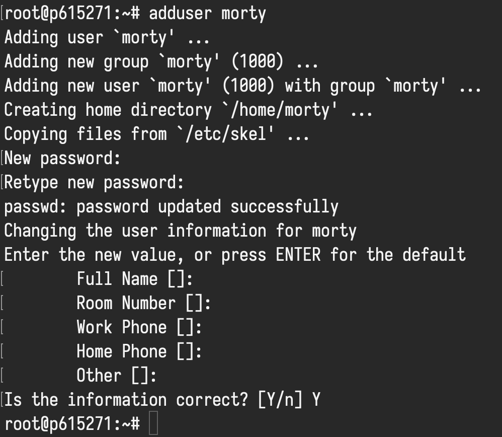

## Предварительная настройка сервера

> <i class="fas fa-info-circle"></i> В этом разделе предлагаю
> создать нового пользователя, подключить доступ к серверу через SSH-ключ
> и отключить root пользователя для безопасности.
>
> Эти действия можно пропустить.

### Создание нового пользователя

Все команды выполняются от пользователя root.

Создаем пользователя `morty` (можете выбрать любое другое имя):

```shell
adduser morty
```

Предложат два раза ввести пароль пользователя.
Другие данные не вводите, просто прощелкайте Enter.
Подтвержайте создание пользователя Y.


