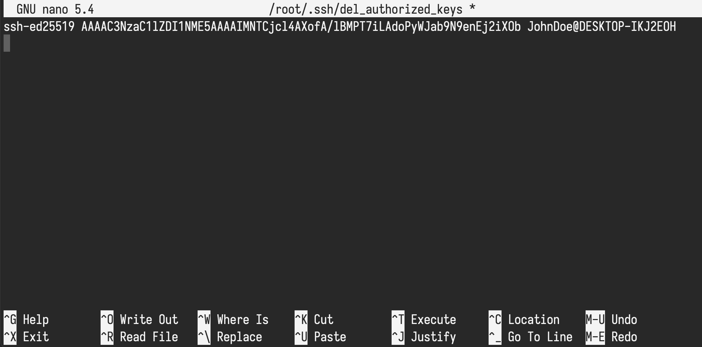
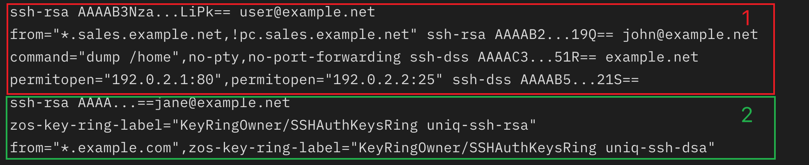

Инструкция подходит для серверов на Linux (Ubuntu/Debian/CentOS Stream).

Получите доступ к серверу, обычно у вас есть ip адрес, логин и
пароль от root пользователя (или пользователя с правами root).

В терминале выполните команду вида:

```bash
ssh [user]@[ip]
```

замените `[user]` и `[ip]` на имя пользователя и адрес сервера, соответственно.
Далее будет вопрос о доверии к этому подключении, введите yes. Введите пароль
и попадете на сервер.

Пример команды:

```bash
ssh root@45.134.83.43
```

## Создание и копирование публичного ключа SSH на сервер

Создайте или используйте существующий ключ SSH.

- [раздел: Создание пары ключей SSH + Активация ключа]( "Создание пары ключей SSH")

> <i class="fas fa-info-circle"></i> Сделайте бекапы ключей SSH
> на флешку или в другие места, так как при потере ключей вы не
> сможете получить доступ к серверу.

Скопируйте публичный ключ на удаленный сервер:

### <i class="fab fa-apple"></i> MacOS & <i class="fab fa-linux"></i> Linux

На хост машине выполните команду

```bash
ssh-copy-id -i ~/.ssh/id_ed25519.pub root@45.134.83.43
```

после -i укажите путь до файла с публичным ключом.

### <i class="fab fa-windows"></i> Windows

Откройте в текстовом редакторе файл с публичным ключом и
скопируйте текст в буфер обмена.

Зайдите на удаленный сервер через консоль,
создайте директорию `.ssh` командой `md .ssh` если ее нет.

Проверить список директорий, команда `ls -al ~`.

Создайте в редакторе nano новый файл с именем authorized_keys:

```bash
nano ~/.ssh/authorized_keys
```

Вставьте содержимое публичного ключа.



Сохраните командой хоткеем`CTRL+O`, далее `Enter` и закройте редактор `CTRL+X`.

Можете для проверки вывести в консоль сервера содержимое файла:

```bash
cat  ~/.ssh/authorized_keys
```

Осталось установить права доступа для файла и директории .ssh:

```bash
chmod 700 ~/.ssh && chmod 600 ~/.ssh/authorized_keys
```

Выходите из консоли сервера `exit`.

## Входим на сервер по SSH

После удачного копирования ключа, попробуйте выполнить вход
на сервер:

```bash
ssh root@45.134.83.43
```

У вас не попросят пароль и вы сразу попадете в консоль сервера.

> <i class="fas fa-info-circle"></i> Если вам требуется заходить на сервер с других
> компьютеров, повторите действия по созданию ключа и скопируйте на сервер новый
> публичный ключ. Каждый новый ключ начинается с новой строки.



## Закрываем вход по паролю

Доступ по паролю уже не требуется, и чтобы
не было возможности подобрать пароль к пользователю root -
отключим такую возможность для всех пользователей сервера.
Доступ будет только по ключу SSH.

> <i class="fas fa-info-circle"></i> Перед этими действиями, убедитесь в
> возможности подключения к серверу через SSH, так как после вы не сможете
> подключиться используя пароль.

Зайдите на сервер командой

```bash
ssh root@45.134.83.43
```

Откройте в текстовом редакторе nano файл с настройками доступа:

```bash
nano /etc/ssh/sshd_config
```

Найдите строки (`F6` включает поиск), расскомментируйте при
необходимости и измените значения на следующие:

```text
PasswordAuthentication no

ChallengeResponseAuthentication no

UsePAM no
```

Строки с параметрами находятся в разных местах файла,
найдите и убедитесь в значении каждой.

Сохраните файл сочетанием клавиш `CTRL+O`, далее `Enter` и
закройте редактор `CTRL+X`.

Перезагрузите сервис ssh:

```bash
systemctl restart ssh
```

После рестарта сервиса доступ по паролям будет закрыт.

⭐️ Теперь ваш сервер лучше защищен от несанкционированного доступа,
при необходимости в более надежной защите, возможно создать пользователя без рут
доступа и отключить прямой доступ к пользователю root. Но это уже совсем другая история :)
