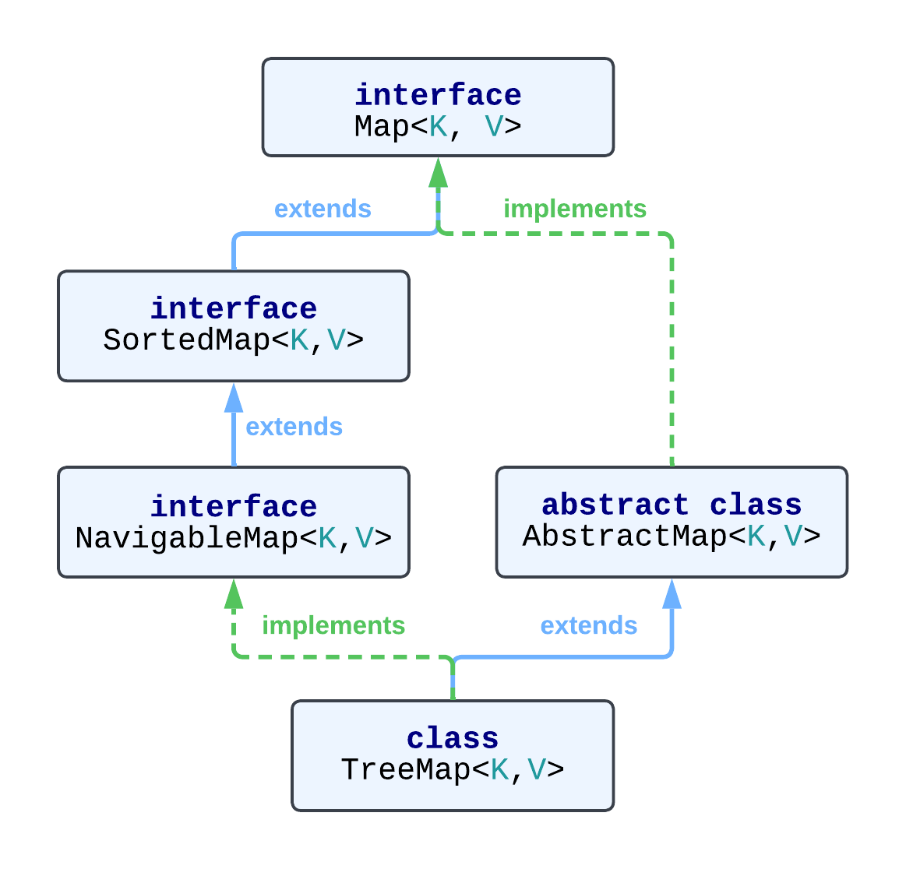

Класс TreeMap входит в состав Java Collection Framework и
представляет собой структуру данных в виде дерева. Разберемся, как устроен и когда стоит применять. Особенность
TreeMap - ключи хранятся в отсортированном порядке и сложность
поиска ключа составляет O(log n).

> используется в примерах Java версии 17

## Иерархия наследования TreeMap

Класс <a href="https://docs.oracle.com/en/java/javase/17/docs/api/java.base/java/util/TreeMap.html" target="_blank">TreeMap</a>
наследует интерфейс
<a href="https://docs.oracle.com/en/java/javase/17/docs/api/java.base/java/util/NavigableMap.html" target="_blank">NavigableMap</a>
и расширяет абстрактный класс <a href="https://docs.oracle.com/en/java/javase/17/docs/api/java.base/java/util/AbstractMap.html" target="_blank">AbstractMap</a>.



`NavigableMap` обязывает класс реализовать методы, часть из которых:

* `Map.Entry<K,V> firstEntry()` - получение записи Entry с наименьшим ключом.
* `Map.Entry<K,V> lastEntry()` - получение записи Entry с наибольшим ключом.
* `Map.Entry<K,V> pollFirstEntry()` - возвращает запись Entry с наименьшим ключом и удаляет из TreeMap.
* `Map.Entry<K,V> pollLastEntry()` - возвращает запись Entry с наибольшим ключом и удаляет из TreeMap.
* `NavigableMap<K,V> descendingMap()` - возвращает Map в обратном направлении, изменения в возвращаемом Map напрямую влияет на исходную TreeMap
* `K lowerKey(K key)` - получение первого ключа, точно меньше по значению чем переданный ключ или null, если такого ключа не найдено
* `K higherKey(K key)` - получение первого ключа, точно больше по значению чем переданный ключ или null, если такого ключа не найдено

Остальные методы похожи на представленные в списке или имеют вариации.

Класс `AbstractMap` уже имеет часть реализаций интерфейса `Map`, например `int size()`, `boolean isEmpty()`,
`boolean containsValue(Object value)`, `boolean containsKey(Object key)` и другие. Причем, часть из них `TreeMap`
переопределяет для реализации своей структуры.

## Особенности TreeMap

Перед погружением в структуру класса, рассмотрим - "Что делает TreeMap особенным и когда стоит его использовать?"

Стоит использовать TreeMap, в случае если вам требуется быстро извлекать данные по ключу, при этом требуется сортировка по ключу.
Например, если вам необходимо получать минимальный или максимальный ключ или получать набор данных меньше или больше определенного ключа.

Если обратиться к более конкретным примерам:

* необходимо хранить строки-ключи в алфавитном порядке, ключ String.
* расположить объекты по приоритету, но получать по ключу. *Первую часть у нас может решить TreeSet, но получать по ключу мы не можем.*
* хранить объекты в разных TreeMap, с разной сортировкой.

> Воспользоваться всеми преимуществами TreeMap возможно, если объявлять тип не просто Map, а
> NavigableMap<K,V> или TreeMap<K,V>

🧑‍💻 **Пример:**

Записать слова Zeta, Asteroid, back, Art, Bow, zen  в списки по первой букве:

```java
{a=[Asteroid, Art], b=[back, Bow], z=[Zeta, zen]}
```

или по количеству букв:

```java
{3=[Art, Bow, zen], 4=[Zeta, back], 8=[Asteroid]}
```

Таким образом, мы можем быстро получить все слова на букву B или все слова,
в которых количество букв больше 3.

Код реализующий пример выше:

```java
String[] words = { "Zeta", "Asteroid", "back", "Art", "Bow", "zen" };

        // создаем TreeMap и заполняем словами, ключ для каждого - первая буква
        // используем в объявлении типа именно NavigableMap, так как нам нужны будут
        // его уникальные методы
        NavigableMap<Character, List<String>> wordsByFirstLetter = new TreeMap<>();

        for (String s : words) {
            wordsByFirstLetter
                    .computeIfAbsent(s.toLowerCase().charAt(0), ArrayList::new)
                    .add(s);
        }

        System.out.println(wordsByFirstLetter);
        
        // Все слова на букву b
        System.out.println(wordsByFirstLetter.get('b'));

        // создаем TreeMap и заполняем словами, ключ для каждого - длина слова
        // используем в объявлении типа именно NavigableMap, так как нам нужны будут
        // его уникальные методы
        NavigableMap<Integer, List<String>> stringsBySize = new TreeMap<>();

        for (String s : words) {
            stringsBySize.computeIfAbsent(s.length(), ArrayList::new).add(s);
        }

        System.out.println(stringsBySize);
        
        // Получим все слова длиной больше или равные 4 и сведем в один список
        List<String> wordsLengthGtThree = stringsBySize.tailMap(4)
                .values()
                .stream()
                .flatMap(Collection::stream)
                .toList();

        System.out.println(wordsLengthGtThree);
```

Результат работы:

```text
{a=[Asteroid, Art], b=[back, Bow], z=[Zeta, zen]}
[back, Bow]
{3=[Art, Bow, zen], 4=[Zeta, back], 8=[Asteroid]}
[Zeta, back, Asteroid]
```

## Что внутри TreeMap?

Для этого зайдем в исходный код самого класса и найдем,
что он хранит в полях:

* Компаратор - неудивительно, ведь нам нужны правила для сравнения ключей и расположения их
в нужном порядке.

```java
private final Comparator<? super K> comparator
```

* Корневая запись, содержащая ключи K и значение V.

```java
private transient Entry<K,V> root
```

* счетчик размера элементов size, при добавлении +1, при удалении -1

```java
private transient int size = 0
```

* счетчик изменений коллекции, используется для определения попытки изменить
TreeMap несколькими потоками. Если такое будет замечено - получим `ConcurrentModificationException`

```java
private transient int modCount = 0
```

Больше ничего и нет в TreeMap, если не учитывать `size` и `modCount` - ведь они не несут полезной информации.
То в TreeMap есть только компаратор и ссылка на корневой элемент дерева.

И скорее вы уже слышали, что в `TreeMap` используется красно-черное дерево. Давай посмотрим наглядно, что
происходит, когда мы создаем `TreeMap` и наполняем его элементами. Будем использовать наш пример со словами.

### Конструкторы

Первое что нам нужно - создать новый `TreeMap`. Какие у нас есть конструкторы для этого?

* Конструктор по умолчанию
  
```java
var wordsByLength = new TreeMap<Integer, String>();
```

После его создания внутри класса `comparator=null`, `root=null`, `size=0`, `modCount=0`. Полностью пустой класс.
Пустым конструктором можно пользоваться, если класс ключа реализует интерфейс `Comparable`, который
делаем возможным сравнить два объекта класса и расставить их по порядку. Класс Integer наследует Comparable
и мы можем его использовать как ключ без дополнительных настроек.

* Конструктор c компаратором

```java
record Planet(String name, long radius) {}

var populationByPlanet = new TreeMap<Planet, Long>(
    Comparator.comparing(Planet::radius));
```

После создания, снова заглянем внутрь `TreeMap` и увидим: `comparator=Comparator$lambda@716`, `root=null`,
`size=0`, `modCount=0`. Мы передали компаратор в виде лямбды и видим - класс знает в каком порядку
расположить планеты. Можно заполнять планетами и они будут расположены в порядке роста радиуса.

🌟 Больше про компараторы и варианты сортировки -
[в моей статье "Сортировка в Java"]()

* Конструктор принимающий другую Map

```java
var treeMap = new TreeMap<>(Map.of(8, "Oxygen", 75, "Rhenium"));
```

Integer известно как сравнивать - компаратор не понадобится. И в итоге в объекте
`comparator=null`, `root=TreeMap$Entry`, `size=2`, `modCount=2`.

В конструкторе произошло добавление элементов, поэтому видим - корневой элемент уже не пустой,
было 2 модификации и количество элементов равно 2. Пока достаточно того, что у нас данные из
`Map` перенеслись в `TreeMap`. Дальше мы будем смотреть как они располагаются.

* Конструктор принимающий SortedMap

Фактически это конструктор принимающий другую `TreeMap`, так как `TreeMap` это наследник `SortedMap`.
При этом копируется значение comparator и все элементы переносятся во вновь созданный
`TreeMap`.

```java
var treeMap = new TreeMap<>(Map.of(8, "Oxygen", 75, "Rhenium"));
var subTreeMap = new TreeMap<>(treeMap.subMap(10, 100));
```

В subTreeMap будет один элемент `{75 => "Rhenium"}`. Если мы просто сохранили результат
метода `treeMap.subMap(10, 100)`, то получили `SortedMap`, а не `TreeMap`.

## Заключение

В этой небольшой статье было показано какие особенности есть у `TreeMap` и
в каких случаях его стоит применять.


