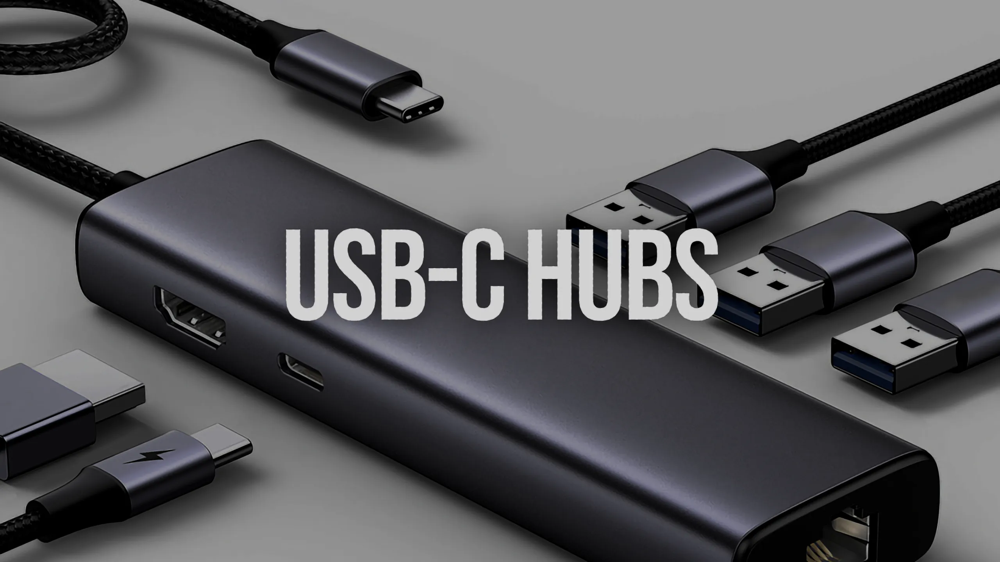
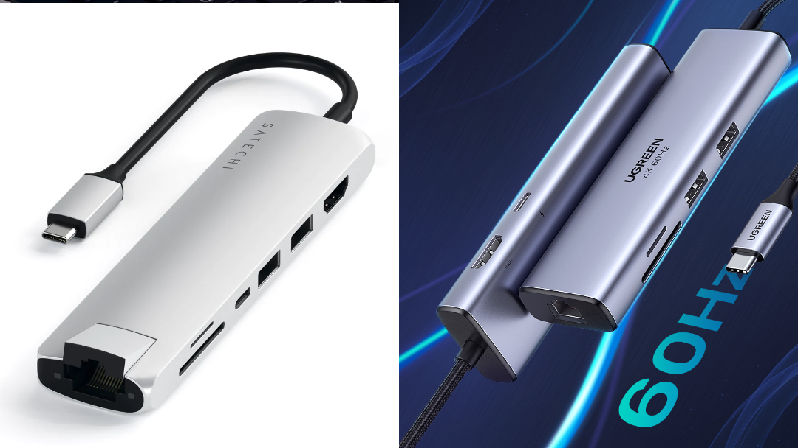

В современных ноутбуках и макбуках существует нехватка портов, но
при этом появились универсальные USB-C порты поддерживающие как
обычные USB устройства, так и Power Delivery для зарядки устройства
или использование в качестве видеовыхода.

Но все равно, двух-трех портов не хватает, да и требуется набор
переходников, что не совсем удобно. Поэтому и появились хабы,
значительно расширяющие интерфейсы устройства. А для тех, кто
перемещается с ноутом, дают удобство - сел за рабочее место и
воткнул один кабель, и подключил сразу монитор, клавиатуру, принтер
и, например, сетевой гигабитный интернет.

Вот про них и расскажу, у меня есть два таких хаба.
Первый Satechi USB-C Slim Multi-Port,
а второй от UGREEN CM512.

> <i class="fas fa-info-circle"></i> UGREEN имеет разные ревизии CM512, я рассказываю о версии CM 512 60515. Будьте внимательны при выборе!

DisplayPort & power delivery

> ❇️ Не все ноутбуки с портом USB-C в полной мере поддерживают работу
> таких USB хабов. Уточняйте в характеристиках ноутбука. Если есть USB-C с
> возможностью DisplayPort - сможете через хаб подключать монитор. Если
> указано PowerDelivery - дополнительно будет работать заряд аккумулятора
> через хаб.

## Технические требования

При выборе хаба, установил несколько требований:

- поддержка выдеовыхода 4K (3840 x 2160) 60Hz, так как оказалось, что большинство
  работают только на частоте 30Гц.
- RJ45 вход для подключения сетевого кабеля на скорости 1Гбит/с. Мне кажется,
  это не так критично, но если хочется быстрого интернета - приятная опция.
- Поддержка Power Delivery не менее 60 Ватт. По простому - зарядка ноута, такая
  мощность подходит для современных ноутбуков без дискретной видеокарты или для
  макбуков на чипах M1

## Внешний вид

Оба хаба, имеют одинаковый форм-фактор. Блок с портами и неотделяемые провод с
USB-C входом.

У Satechi Slim порт RJ45 находится напротив кабеля питания, на короткой стороне,
а все остальные порты на одной из боковых граней.

У UGREEN, RJ45 также найдете на торце, а другие порты разделены по обеим сторонам
боковых граней.

## Характеристики

| Параметр                         | Satechi Slim | UGREEN CM512  60515|
| -------------------------------- | ------------ | ------------ |
| Вес                              | 64 грамм     | 72 грамм     |
| Габариты блока                   | 132х33х12 мм | 125х35х16 мм |
| Длина провода                    | 148 мм       | 240 мм       |
| Температура при зарядки ноутбука | 43,7°C       | 40°C         |

- Замер температуры производился при подключении ноутбука на 50% заряда, после подключения зарядного
  устройства до замера температуры прошло 10 минут. Температура окружающего воздуха была 21°С.
- Если ноутбук будет стоять на подставке, то хаб от UGREEN не будет висеть в воздухе, так как провод
  подключения достаточно длинный.
- Разница в размере и весе незначительны. Хотя Satechi оправдывает свое Slim имя.

## Интерфейсы подключения устройств

| Порты          | Satechi Slim                             | UGREEN CM512 60515                       |
| -------------- | ---------------------------------------- | ---------------------------------------- |
| HDMI           | 4K HDMI 2.0 - 60Hz                       | 4K HDMI - 60Hz      |
| Power Delivery | USB-C до 60 Ватт                         | USB-C до 95 Ватт                         |
| RJ-45          | 10/100/1000Mbps, с индикаторами работы   | 10/100/1000Mbps                          |
| SD-card        | чтение до 15,8 MB/s, запись до 89,4 MB/s | чтение до 19,1 MB/s, запись до 89,2 MB/s |
| microSD-card   | чтение до 20,3 MB/s, запись до 86,1 MB/s | чтение до 20,4 MB/s, запись до 82,7 MB/s |
| USB-A 3.0 х2   | чтение до 380 MB/s, запись до 353 MB/s   | чтение до 380 MB/s, запись до 393 MB/s   |

- Основная разница в максимальной выходной мощности PowerDelivery,
остальные характеристики близкие по значениям.
- Судя по скорость записи/чтения формат SD/miniSD карточек памяти UHS-I максимум.
- microSD слот в Satechi с защелкивающимся механизмом, карточка не выпирает, а значит
  можно microSD держать всегда в хабе. У UGREEN microSD просто вставляется и торчит
  наполовину.
- Оба хаба не поддерживают быструю зарядку (QuickCharge) через USB-A порты.
- Если подключить хаб к смартфону, то возможно использовать внешний монитор как дублирование экрана
или DeX Samsung. Быстрая зарядка тоже работает. Данные возможности зависят от телефона.
- Скорость USB портов тестировалось через подключение SSD SAMSUNG 970 EVO Plus.
  При прямом подключении к USB-C порту ноутбука показатели скорости: чтение до 886 MB/s, запись до 753 MB/s

## Скриншоты тестов скоростей

Если интересно подробно посмотреть замеры скоростей, скачайте архив.

[Архив с скриншотами замера скоростей SD, microSD, USB-A](speedtest_satechi_ugreen.zip)

## Выводы и цены

Оба хаба решают поставленные задачи. Хотя мне больше понравился UGREEN: за счет длинного провода,
более высокой мощности выходного питания и низкой рабочей температуры. Также было замечено, что
Satechi Slim греется до 40°С даже без подключения зарядного устройства или каких либо устройств, UGREEN в
этом случае холодный. Возможно это позволит повысить продолжительность работы.

Цены на февраль 2025:

| Магазин         | Satechi Slim | UGREEN CM512 60515 |
| --------------- | ------------ | ------------------ |
| Маркетплейсы РФ | 7 910₽       | 4 089₽             |

Ключевые слова для поиска:

- `Satechi Slim Multiport 7-in-1`
- `UGREEN CM512 60515`

По ценам хаб от UGREEN выглядит более привлекательным.

А окончательный выбор делать только вам. В любом случае, хаб такого вида полезная вещь, как ни странно,
освобождающая от проводов и сохраняет родные порты ноутбука.
