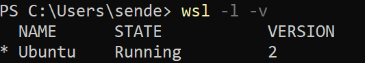
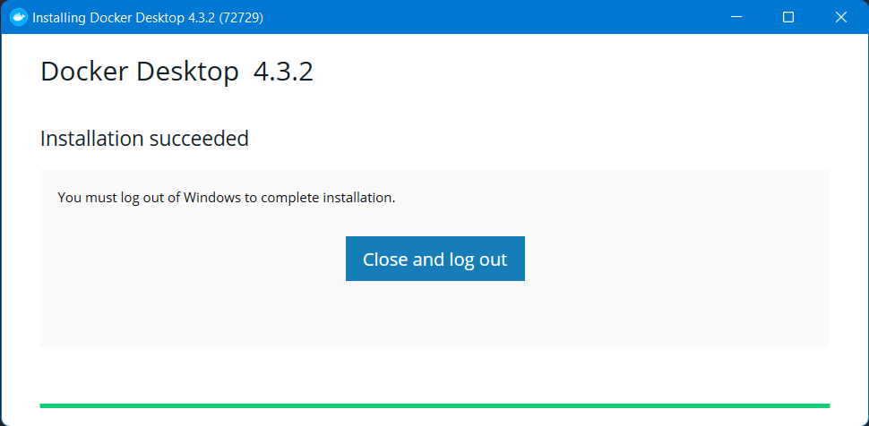
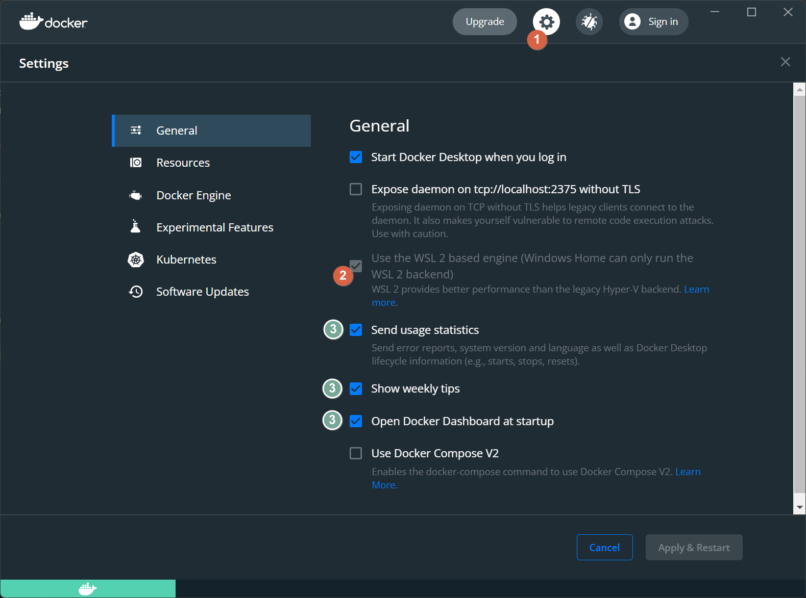
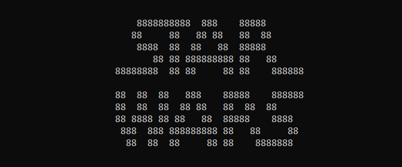

Краткая выдержка команд для установки Docker.

> <i class="fas fa-info-circle"></i> <a href="https://docs.docker.com/desktop/windows/wsl" target="_blank">Полный официальный гайд на странице Docker.</a>

## Необходимые условия

У вас должен быть установлен wsl, командой

```bash
wsl -l -v
```

проверьте существование WSL. На скриншоте с wsl все ок.



Если у вас нет WSL, 
[следуйте инструкции по ссылке]( "Установка WSL2 в Windows")
и возвращайтесь.

## Скачивание и установка Docker

> Все действия выполнялись на Windows 11 (сборка 22000.376) и Docker 4.3.2

- <a href="https://docs.docker.com/get-docker/">Скачайте Windows</a> установку с официального сайта.
- Запустите установку и просто прожимайте Далее. По окончанию, перезагрузитесь или выполните  Выход (Log out).



- Сразу при входе или первом запуске Docker, вам предложат принять соглашение.
- Далее будет запуск необходимых служб. Открывайте Docker Dashboard, ярлык на рабочем столе или в трее иконка.
- Зайдите в настройки (1) и убедитесь (2) - что выбран WSL2.
- Если хотите чтобы Docker вас лишнего не тревожил отключите пункты (3).  



Установка завершена!

## Запуск первого контейнера

Попробуйте запустить контейнер через консоль wsl.
Например, поднимем текстовый рассказ фильма Star Wars в контейнере.

- Запустите WSL консоль.
- Введите команду:

```docker
docker run -it --rm mikesplain/telnet towel.blinkenlights.nl
```



Кратко по параметрам:

- `run` запуск нового контейнера.
- `-it` контейнер будет запущен в интерактивном (i) режиме, и в используется tty взаимодействие, позволяет использовать консоль внутри контейнера (t).
- `--rm` контейнер будет удален после завершения своей работы.
- `mikesplain/telnet` название образа, он будет загружен из dockerhub.
- `towel.blinkenlights.nl` параметр, который будет использовать контейнер. В данном случае программа telnet.

В итоге увидите титры и начало истории, а значит все работает отлично
и можно полноценно пользоваться Docker.

🚀 Не залипните на звездные войны :)

## 🎁 Полезные ссылки

- <a href="https://www.freecodecamp.org/news/the-docker-handbook/" target="_blank">The Docker Handbook – 2021 Edition</a>

Изучаем Docker на Habr

- <a href="https://habr.com/ru/company/ruvds/blog/438796/" target="_blank">Часть 1: основы</a>
- <a href="https://habr.com/ru/company/ruvds/blog/439978/" target="_blank">Часть 2: термины и концепции</a>
- <a href="https://habr.com/ru/company/ruvds/blog/439980/" target="_blank">Часть 3: файлы Dockerfile</a>
- <a href="https://habr.com/ru/company/ruvds/blog/440660/" target="_blank">Docker команды</a>
