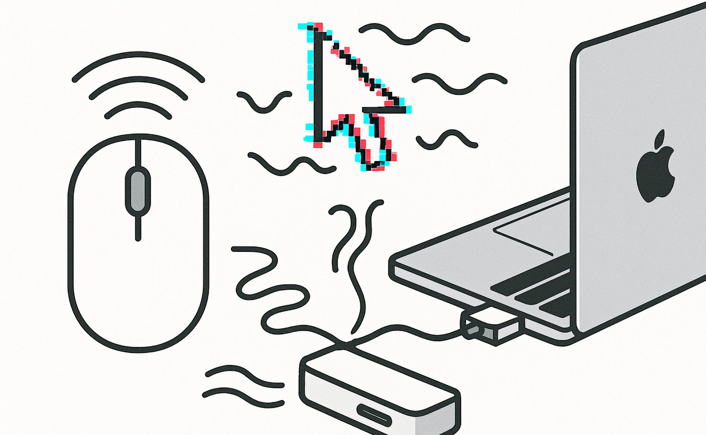

Если вы подключаете беспроводную мышь к **Mac** или **MacBook** через **USB-донгл**, и курсор начинает:

- дергаться  
- тормозить  
- замирать  

— значит, вы столкнулись с распространенной проблемой.  

Я не сразу понял в чем проблема, так как у меня разные ОС и хаб
хаб переключается между разными устройствами. И только в MacOs
все лагает и тормозит.

## 🔍 Причина

Когда USB-донгл мыши вставлен в **USB 3.0 порт**, особенно на хабе, возникают **помехи**.  

USB 3.0 создает электромагнитные наводки, которые мешают беспроводной
связи на частоте **2.4 ГГц** — на ней работает большинство беспроводных мышей.

## ✅ Решение

Все просто – **Используйте USB 2.0 удлинитель или переходник.**

У меня как раз был в комплекте удлинитель для донгла,
видимо не зря. Подключил его проблема исчезла.

Варианта подключить к USB 2.0 у меня не было, так как таких потов в хабе
для MacBook не нашлось, все были 3.0.

## На каких мышах была проблема

- Lamzu Thorn
- Defender Prime
- Logitech M170

